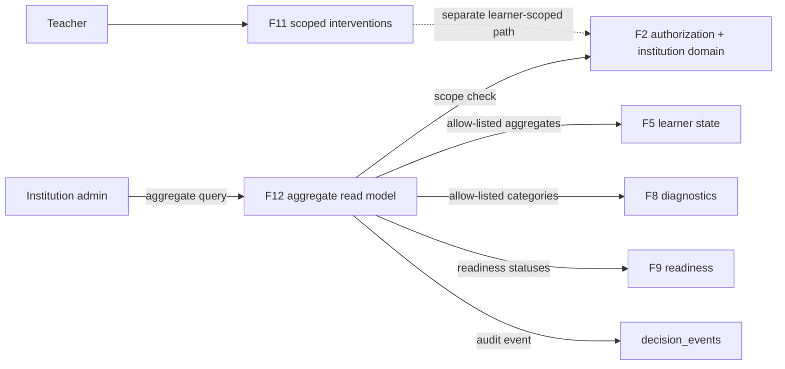
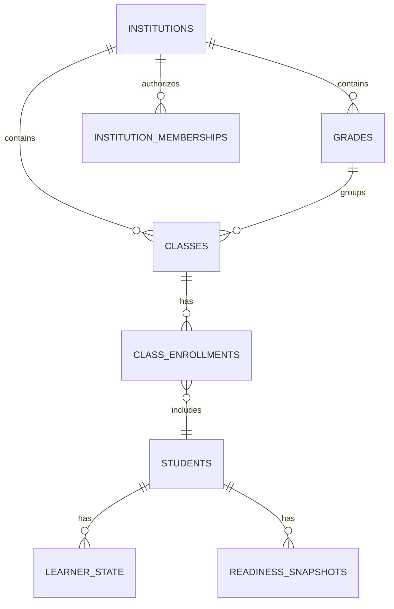

# F12 — Institution Intelligence Architecture Discovery

**Version:** 0.1 · **Date:** 2026-09-19 · **Status:** CONDITIONAL — ready for a bounded aggregate-read-model implementation; not ready for pilot or release.

This package is the F12 architecture baseline. It implements no institutional dashboard and changes neither production nor learner data.

## 1. Architecture Brief

**Problem.** Institution administrators need to identify cohort-level academic patterns and allocate support, without being given learner records merely because they hold an institutional role.

**Outcome.** A dynamic dashboard can compare institution, grade, class and subject aggregates for evidence coverage, learning-state distribution, learning debt and exam-readiness dimensions. It supports triage, not learner ranking or automated action.

**Actors.** Institution administrator: approves/rejects teacher memberships and reads aggregate insights within their institution. Teacher: keeps the existing scoped class/intervention experience. Student and parent: receive no new F12 authority.

**In scope.** Aggregate read API, filters, cross-filtered visualizations, cohort-size privacy guard, audit events and a thin dashboard. **Excluded.** Learner drill-down, names, raw responses, rankings, automatic intervention creation, batch assignment, predictive scoring, new role types, Production release.

| ID | Status | Statement |
|---|---|---|
| REQ-F12-01 | confirmed | Reuse F2 institution entities and authorization. |
| REQ-F12-02 | confirmed | Institution admins approve teacher memberships; they do not gain learner-level access. |
| REQ-F12-03 | accepted | Dashboard supports institution/grade/class/subject filtering and cross-comparison. |
| REQ-F12-04 | accepted | A segment must contain at least 10 active learners before aggregate display. |
| REQ-F12-05 | assumed | First release is read-only decision support. |

## 2. Context Diagram

Trust boundary: F12 never returns learner IDs, names, raw evidence, responses, prompts, internal algorithm values or per-student records.

## 3. Logical Architecture

1. **Route/controller** resolves authenticated canonical user server-side, validates filters and returns a narrow DTO.
2. **Scope resolver** calls F2 `canAccessInstitution`; every requested grade/class/subject must belong to that institution.
3. **Aggregate query service** uses explicit SQL projections grouped by the selected dimensions; it never loads a learner record into application memory.
4. **Disclosure-control service** suppresses segments below 10 active learners and suppresses derived comparisons if either side is suppressed.
5. **Visualization view model** exposes cards, trend series, stacked distributions and comparison rows; filters are query parameters, not client-side copies of raw data.
6. **Audit writer** records an aggregate-view decision event without raw result payloads.

Critical failure: invalid scope, absent membership or below-threshold cohort returns a controlled `not available` result, never an empty-looking data set that can be used for inference.

## 4. Deployment Model

Use the existing Next.js application, Vercel Preview/Production topology, Clerk session boundary and Postgres database. F12 adds no service, queue, datastore or external analytics vendor for its first release. Preview uses synthetic/local certification data only. Migrations remain additive and are applied by the existing governed runner; no migration runs at application startup. Rollback is application-code rollback; aggregate tables, if later introduced, must be additive and ignored safely by prior code.

## 5. Data Architecture

Sources of truth remain F2 institutional relations, F5 learner state/evidence summaries, F8 gap categories and F9 readiness statuses. F12 creates a query-time aggregate read model first; no duplicated learner-state table.

Allowed measures: active cohort count; count/percentage in a named learner-state bucket; evidence-sufficiency count; debt category count; readiness-dimension status count; completed simulation count; weekly aggregate trend. Disallowed: raw scores, raw answers, prompts, learner identifiers, small-cell counts, model/algorithm internals.

## 6. Security Model

| Role | Scope | Allowed F12 action |
|---|---|---|
| Institution admin, approved membership | exact institution | read protected aggregates; decide pending teacher memberships through existing F2 capability |
| Teacher | active assignment/class | no F12 institutional aggregate endpoint in first release |
| Student/Parent | n/a | denied |
| Other institution admin | different institution | denied |

Controls: server-side actor resolution; F2 exact-institution authorization; constrained filter values; active-enrollment cohort denominator; `k=10` suppression; no `SELECT *`; no learner identifiers in DTO/logs; audit without raw content; rate limits to be specified before pilot. Threats include cross-tenant access, difference attacks through filters, reidentification, stale membership and inference from empty states.

## 7. NFRs

| ID | Target | Status / validation |
|---|---|---|
| NFR-F12-01 | Aggregate query p95 ≤ 2 s for a 10,000-active-learner institution | TBD load test |
| NFR-F12-02 | Unauthorized and cross-institution query returns no data | required adversarial certification |
| NFR-F12-03 | Cohorts under 10 never expose counts, percentages or trends | required privacy test matrix |
| NFR-F12-04 | Freshness label exposes data as-of time; initial target ≤ 24 h | proposed |
| NFR-F12-05 | Dashboard keyboard navigable and chart data has tabular alternative | required UI certification |
| NFR-F12-06 | No raw learner/AI content in audit/telemetry | required structural guard |

## 8. ADRs

- **ADR-F12-01 (accepted):** query-time aggregate read model over a new analytics store. It is the smallest viable path, preserves source-of-truth ownership and is reversible. Revisit when p95 or query cost violates NFR-F12-01.
- **ADR-F12-02 (accepted):** `k=10` minimum disclosure threshold across every slice and comparison. Simpler than differential privacy for the initial release. Revisit only with a formal privacy review.
- **ADR-F12-03 (accepted):** institution-admin aggregate access remains distinct from learner access. This preserves F2’s explicit boundary.
- **ADR-F12-04 (proposed):** use structured chart data returned by the API and render with the existing web stack; do not send institution data to a third-party analytics/AI vendor.

## 9. Risk Register

| ID | Risk | Mitigation | Trigger |
|---|---|---|---|
| RISK-F12-01 | Difference attacks reveal small groups | suppress any segment/comparison below k and test complementary filters | privacy test failure |
| RISK-F12-02 | Cross-institution leakage | exact F2 check plus filter-ownership joins | adversarial test failure |
| RISK-F12-03 | Misleading stale aggregate | surface as-of time and define refresh objective | data age > target |
| RISK-F12-04 | Dashboard prompts inappropriate intervention | read-only first release; no automated action | product asks for action controls |
| RISK-F12-05 | Jurisdictional obligations are unknown | legal/privacy owner confirms pilot context before real data | pilot planning |

## 10. Scaling & Operations Plan

Start with indexed query-time aggregates. Instrument query duration, cardinality, suppression rate, authorization denial rate and source freshness. Add a materialized aggregate only if measured p95, database load or refresh cost exceeds the agreed target. Existing database backup/recovery controls apply; F12 adds no separate persistence initially. Support owner and on-call remain TBD.

## 11. Maintenance Model

Product owns definitions and visible labels; engineering owns query correctness and migrations; security/privacy owner approves disclosure policy and pilot jurisdiction; operations owns alerts and recovery. Review access and thresholds before each pilot. Dependency updates follow the existing application cadence. No external model or analytics dependency exists in the first release.

## 12. Tech Stack Recommendation

| Capability | Recommendation | Reason |
|---|---|---|
| Application/API | existing Next.js server routes | minimizes deployment surface |
| Authorization | existing F2 service | exact institution scope already certified |
| Data | existing Postgres SQL read model | relational joins and grouping; no duplicate source |
| Charts | client-rendered accessible components with a table fallback | supports interactive comparisons without sending data externally |
| Audit | existing decision-event pattern | preserves audit boundary |

## 13. Phased Implementation Roadmap

1. **Discovery and privacy contract:** confirm open decisions and certify aggregate/suppression queries.
2. **Aggregate API:** F2 authorization, filter ownership, allow-listed DTO and audit event.
3. **Dynamic dashboard:** filters, cards, distribution/trend/comparison visuals and accessibility table.
4. **Pilot hardening:** real-data privacy review, load test, freshness monitoring and authenticated Preview smoke.
5. **Evolution:** consider materialized aggregates only on measured need; separately assess any action workflow.

## 14. Open Decisions

| ID | Decision | Impact |
|---|---|---|
| Q-F12-01 | Confirm pilot jurisdiction, age groups and privacy owner | blocks pilot/release, not architecture work |
| Q-F12-02 | Confirm exact data freshness target | blocks production SLO |
| Q-F12-03 | Confirm whether academic coordinators are a distinct role/scope | blocks role expansion, not admin MVP |
| Q-F12-04 | Confirm which decision is primary: support triage, curriculum coverage or exam readiness | determines default dashboard and KPI ordering |
| Q-F12-05 | Confirm retention policy for aggregate audit events | blocks pilot compliance sign-off |

## 15. Readiness Assessment

| Dimension | Weight | Level | Score |
|---|---:|---:|---:|
| Business, scope and processes | 15 | 2 | 7.5 |
| Users, roles and ownership | 10 | 3 | 7.5 |
| Data and integrations | 15 | 3 | 11.25 |
| Security, privacy and compliance | 15 | 2 | 7.5 |
| NFRs, demand and resilience | 15 | 2 | 7.5 |
| Architecture and evolution | 10 | 3 | 7.5 |
| Deployment, operation and maintenance | 10 | 2 | 5.0 |
| Cost, roadmap and risks | 10 | 2 | 5.0 |
| **Total** | **100** |  | **58.75 / 100** |

**Gate: DISCOVERY REQUIRED.** The architecture is sufficient to start the bounded API/UI design only after the aggregate privacy test contract is specified. It is not ready for pilot because jurisdiction, privacy ownership, retention, NFR values and the primary decision remain open.
