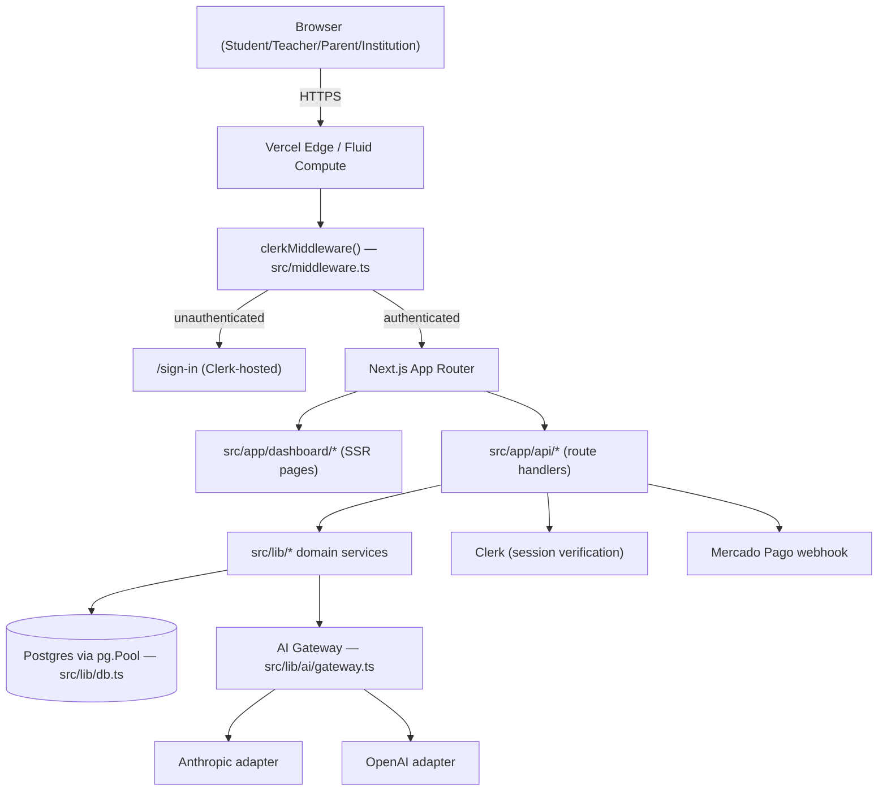

# 01 — System Architecture

## Stack (real, as deployed)

| Layer | Technology | Notes |
|---|---|---|
| Framework | Next.js, App Router | `src/app/` — pages and API routes co-located |
| Language | TypeScript | Strict-mode `tsc --noEmit` is a hard gate in every phase |
| Database | PostgreSQL (Neon-hosted) | Accessed via the raw `pg` driver — **no ORM**. See `src/lib/db.ts` |
| Auth | Clerk | `@clerk/nextjs`, `clerkMiddleware()` in `src/middleware.ts`, no custom sign-in/sign-up routes (Clerk's own default catch-all `/sign-in/[[...rest]]`, `/sign-up/[[...rest]]`) |
| Hosting | Vercel | Project `study-so/study-os`. See [09_DEPLOYMENT_ENVIRONMENTS_AND_RELEASE.md](09_DEPLOYMENT_ENVIRONMENTS_AND_RELEASE.md) |
| AI providers | Anthropic, OpenAI | `src/lib/ai/adapters/{anthropic,openai}.ts`, routed through a single gateway (`src/lib/ai/gateway.ts`) — see [07_AI_ARCHITECTURE_AND_SAFETY.md](07_AI_ARCHITECTURE_AND_SAFETY.md) |
| Testing | Vitest | `vitest.config.mts`, 355 test files as of this package |
| Payments | Mercado Pago | `src/app/api/webhooks/mercadopago/route.ts`, `payments`/`price_book`/`subscriptions` tables |

## Directory structure (real, top-level)

```
src/
  app/
    api/            -- ~34 route groups (see table below)
    dashboard/       -- ~19 authenticated page groups, one per workspace concern
    [locale]/        -- i18n-aware public routes
    sign-in/ sign-up/ -- Clerk catch-all routes
    role-select/      -- post-auth workspace selection
  components/         -- shared UI (quiz, ui primitives)
  lib/                -- domain logic, one directory per bounded context (below)
  services/           -- cross-cutting services (e.g. identity-backfill.service.ts)
  types/              -- shared TypeScript types
scripts/
  operations/         -- real-Postgres certification scripts, one per phase/domain
  db-migrate.ts        -- the migration runner (see 03)
  backfill-*.ts         -- one-off, re-runnable backfill scripts
database/
  migrations/           -- 31 chronologically-named .sql files (+ 1 baseline snapshot ledger row)
  baseline/              -- the original pg_dump snapshot this history starts from
  ledger/                -- the schema_migrations table's own DDL
```

## `src/lib/` bounded contexts (real directories, not an idealized DDD diagram)

`ai`, `algorithms`, `assessment`, `audit`, `authorization`, `catalog`, `curriculum`, `diagnostics`, `entitlements`, `identity`, `institution-intelligence`, `learner-state`, `learner-twin`, `lx`, `observability`, `parent`, `pedagogical-decision`, `pedagogical-engine`, `pedagogical-migration`, `pedagogical-shadow`, `quiz`, `readiness`, `simulation`, `student`, `teacher`, `teaching`.

Each of these was introduced by a specific phase (see [02_PHASES_F0S_TO_F15.md](02_PHASES_F0S_TO_F15.md)) — this is not a pre-planned architecture drawn up front; it accreted, one certified phase at a time, and still shows that history (e.g. `pedagogical-shadow`/`pedagogical-migration` exist specifically because an earlier engine was migrated to a new one behind a shadow-comparison harness, not because "shadow" and "migration" are generic architectural concepts here).

## High-level request flow



## Identity/authorization layering (summary — full detail in 04)

Identity (`users`/`user_roles`, F1) is layered **additively** on top of two pre-existing identity spaces (`students`, `profiles`) that predate F1 and are never replaced — `students.id`/`profiles.id` remain every learning-domain table's actual foreign-key target. This was a deliberate, documented design choice (see `database/migrations/20260919_1000_f1_unified_identity.sql`'s own header comment) to avoid a big-bang identity migration touching every table in the system.

## What is explicitly NOT the architecture (common misreadings to avoid)

- **No ORM.** All queries are hand-written SQL via `pg`. There is no Prisma/Drizzle/TypeORM schema to consult — `database/migrations/*.sql` and `database/baseline/*.sql` are the only source of truth for schema shape.
- **No microservices.** This is a single Next.js deployment; "services" in `src/services/` and `src/lib/*` are in-process modules, not network-separated services.
- **No message queue / background job system.** Every operation in this codebase is either a synchronous request-response or a manually-triggered script (migrations, backfills) — there is no cron, no queue, no worker process.
- **No generic RBAC table.** Roles/permissions are TypeScript vocabulary plus explicit code (`src/lib/authorization/`), not database-driven `permissions`/`role_permissions` rows — see [04_IDENTITY_ROLES_AND_AUTHORIZATION.md](04_IDENTITY_ROLES_AND_AUTHORIZATION.md) for why this was a deliberate scope decision, not an oversight.
