# 02 — Phases F0-S Through F15 (and F15-C1)

```mermaid
flowchart LR
    F0S["F0-S\nAI global limits\n& security containment"] --> F1["F1\nUnified Identity"]
    F1 --> F2["F2\nInstitutions,\nRelationships,\nPermissions"]
    F2 --> F3["F3\nSubscription/\nEntitlement"]
    F3 --> F4["F4\nCanonical Learning\nArchitecture v2"]
    F4 --> F5["F5\nEvidence &\nLearner State v2"]
    F5 --> F6["F6\nCurriculum/Standards\nMapping"]
    F6 --> F7["F7\nAssessment\nFramework Engine"]
    F7 --> F8["F8\nFramework-aware\nTeaching & Exam Skills"]
    F8 --> F9["F9\nExam Readiness\nSimulation"]
    F9 --> F10["F10\nParent\nExperience"]
    F10 --> F11["F11\n(A/B/C1-C4)\nTeacher Workspace &\nInterventions"]
    F11 --> F12["F12\nInstitution\nIntelligence"]
    F12 --> F13["F13\nUX Consolidation"]
    F13 --> F14["F14\nExperience\nCompletion"]
    F14 --> F15["F15\nPilot Readiness &\nProduction Hardening"]
    F15 --> F15C1["F15-C1\nPilot Gate\nClosure"]
```

Each phase was gated by its own real-Postgres certification, full automated test suite, and QA report before the next phase began. Source documents live under `docs/implementation/<phase>/`. This is a summary, not a replacement — consult the source `*_QA_REPORT.md` for full detail on any phase.

## F0-S — AI Global Limits & Security Containment

**Scope**: global AI cost/usage caps (`database/migrations/20260918_1000_f0s_ai_global_limits.sql`, `src/lib/ai/operational-limits.ts`) and a security containment pass predating the identity work.
**Result**: **PASS** — 289/289 files, 4979/4979 tests. Migration application to any remote environment and authenticated E2E were `BLOCKED` at this point — no Preview/remote database access existed yet.
**Docs**: `docs/implementation/f0s/`.

## F1 — Unified Identity

**Scope**: introduced `users`/`user_roles` (see `database/migrations/20260919_1000_f1_unified_identity.sql`) layered additively over the pre-existing `students`/`profiles` identity spaces, plus the idempotent backfill (`src/services/identity-backfill.service.ts`).
**Result**: **PASS** — 294/294 files, 5022/5022 tests. Real-Postgres migration mechanics certified locally; remote application was `BLOCKED` by design (a deliberate data-safety rule, not a gap) until F15-C1 actually executed it against the real Preview database — see [03_DATABASE_SCHEMA_AND_MIGRATIONS.md](03_DATABASE_SCHEMA_AND_MIGRATIONS.md).
**Docs**: `docs/implementation/f1/`.

## F2 — Institutions, Relationships, Permissions

**Scope**: `institution_memberships`, `parent_student_relationships`, `TeacherAssignment`, and the `LearnerPermission`/`InstitutionPermission` vocabulary (`src/lib/authorization/`) — see [04_IDENTITY_ROLES_AND_AUTHORIZATION.md](04_IDENTITY_ROLES_AND_AUTHORIZATION.md) for the full permission matrix this phase established.
**Result**: **PASS** — 300/300 files, 5078/5078 tests, full negative-authorization matrix and multi-role isolation certified.
**Docs**: `docs/implementation/f2/`.

## F3 — Subscription/Entitlement Foundation

**Scope**: `subscriptions`, `price_book`, entitlement-gating for paid features.
**Result**: **PASS**, including a **LIVE VERIFIED** anonymous smoke test against a real (now-historical) Preview deployment.
**Docs**: `docs/implementation/f3/`.

## F4 — Canonical Learning Architecture v2

**Scope**: `canonical_subjects`/`canonical_concepts`/`canonical_concept_prerequisites`/`canonical_concept_skills`/`canonical_concept_competencies` — a rewrite of the catalog model, with an explicit backward-compatibility contract for the pre-existing `subjects`/`concepts`/`concept_relationships` tables (never dropped).
**Result**: **PASS**. One pre-existing (not-a-regression) authorization gap noted for the residual risk register (`/api/concepts/extract` missing a subject-ownership check).
**Docs**: `docs/implementation/f4/`.

## F5 — Evidence & Learner State v2

**Scope**: `learning_evidence`, `mastery_records`, `concept_knowledge_state`, aggregation policy versioning.
**Result**: **PASS**, zero regressions across the full prior-phase chain.
**Docs**: `docs/implementation/f5/`.

## F6 — Curriculum/Standards Mapping

**Scope**: `structure_nodes`/`structure_versions`, curriculum coverage model, editorial workflow for mapping canonical concepts to real curricula.
**Result**: **PASS**.
**Docs**: `docs/implementation/f6/`.

## F7 — Assessment Framework Engine

**Scope**: `assessment_blueprints`, `exam_definitions`/`exam_versions`, the formal evaluation contract underlying every exam in the system.
**Result**: **PASS** — 5334 tests, a 14-case real-Postgres adversarial certification with zero fixes needed on first run.
**Docs**: `docs/implementation/f7/`.

## F8 — Framework-aware Teaching & Exam Skills

**Scope**: `command_terms`/`command_term_interpretations`, diagnostic policy model, AI-assisted teaching wired to the F7 assessment framework.
**Result**: **PASS**, with explicitly registered deferrals (none silently upgraded) — 5403 tests, 17-case real-Postgres certification.
**Docs**: `docs/implementation/f8/`.

## F9 — Exam Readiness Simulation

**Scope**: `simulation_plans`/`simulation_attempts`, `readiness_snapshots`, `readiness_policy_versions` — the readiness-scoring system every later phase (including F15's own exam-taking UI) builds on.
**Result**: **PASS** — 5479 tests, adversarial + concurrency + performance real-Postgres certification.
**Docs**: `docs/implementation/f9/`.

## F10 — Parent Experience

**Scope**: Parent-facing read model over `parent_student_relationships`.
**Result**: **PASS**, plus a genuine, real bug found and fixed **after** initial certification (`F10_MULTI_ROLE_AUTHORIZATION_CHECK.md`): a Parent-scoped route's authorization check treated Owner/Parent/Teacher as equivalent, letting a user view a student through the Parent route via an unrelated Teacher relationship. Fixed and re-certified. 5512 tests.
**Docs**: `docs/implementation/f10/`.

## F11 (A / B / C1–C4) — Teacher Workspace & Interventions

**Scope**: four sub-phases — F11-A (Teacher authorization read model), F11-B (`teacher_interventions` domain), F11-C1–C4 (concept/skill/competency/exam reinforcement execution) — culminating in an integrated certification.
**Result**: **PASS** — 44 real-Postgres assertions across 10 certification sections, zero regressions across 14 independently re-run prior certifications, full 5589-test suite.
**Docs**: `docs/implementation/f11/`.

## F12 — Institution Intelligence

**Scope**: `institutions`, `institution_analytics_policy_versions`, aggregate Diagnostics/Interventions/Coverage/Readiness summaries for institution admins — including MIN_COHORT_POLICY-style cohort-size suppression to prevent re-identification of individual students in small cohorts.
**Result**: **PASS (local)** — 5597 tests, 15 independently re-run prior certifications. Remote Preview verification honestly deferred at the time (Preview CLI linkage had been lost since ~F5, not rediscovered until F15).
**Docs**: `docs/implementation/f12/`.

## F13 — UX Consolidation

**Scope**: design-system consolidation, global navigation model, Exam Prep experience UI, accessibility and cache-isolation reports.
**Result**: **PASS (local/structural)**, with remote/live verification honestly deferred (same lost-Preview-linkage reason as F12).
**Docs**: `docs/implementation/f13/`.

## F14 — Experience Completion & Readiness Migration

**Scope**: Student Exam Prep/Assignment UIs, Parent dashboard migrated to canonical F9 readiness, Institution UX (Grades/Classes/Teachers/Coverage/Readiness), date-drift test fixes.
**Result**: **PASS (local/structural)** — 350/350 files, 5614/5614 tests after root-causing carried-forward date-drift failures; two real bugs found and fixed (one an information-disclosure hardening). One disclosed feature-scope limitation: full item-by-item exam-taking UI not yet built (carried to F15 as `IVG-F14-01`, later resolved).
**Docs**: `docs/implementation/f14/`.

## F15 — Pilot Readiness & Production Hardening

**Scope**: closed F14's exam-taking gap, resolved MIN_COHORT_POLICY as a real product decision, **re-established a repeatable official Vercel Preview deployment** (the CLI linkage — `.vercel/project.json` — had been present in the main checkout but never copied into any of this program's many `git worktree add` checkouts since F5-ish, which is why every phase in between reported "no Preview access"), and surfaced two new hard Pilot gates by actually loading the real Preview: an unrotated exposed credential file, and a Clerk misconfiguration pointing Preview at an unrelated application.
**Result**: **PASS_WITH_CONDITIONS** — 352/352 files, 5632/5632 tests, 16/16 real-Postgres regressions, 0 dependency vulnerabilities (fixed 1 critical + 1 high this phase). `READY FOR PILOT: NO` at close, blocked by the two new hard gates.
**Docs**: `docs/implementation/f15/`.

## F15-C1 — Pilot Gate Closure

**Scope**: closed two of F15's three hard gates.
1. **Preview Clerk misconfiguration**: diagnosed via live browser observation (no credential touched), fixed by the operator (Preview scope only), re-verified live across three subsequent deployments.
2. **Preview database migration state**: discovered the real runtime Preview database was 17 migrations behind (missing `users`/`user_roles`/`institutions`), diagnosed via a temporary, credential-free diagnostic route (`src/app/api/diagnostics/preview-db/route.ts`), classified as a genuine non-corrupt partial history (not the "F1-applied-but-users-missing" corruption pattern that was explicitly checked for and ruled out), rehearsed on a temporary Neon branch, then repaired in place by the operator. Final state independently re-verified: 32/32 migrations, 132 tables, identity integrity at 0 anomalies.

Also added `/api/health` (closing `IVG-F15-13`) and triaged the remaining 15-item technical-debt backlog (`docs/implementation/f15/F15_TECHNICAL_DEBT_TRIAGE.md`).

**Result**: the sole remaining hard gate is credential rotation (`IVG-F14-06`/`IVG-F15-01`), still `OPEN`/`OPERATOR_ACTION_REQUIRED`. Authenticated E2E execution was in progress at the time this package was written — see [13_PILOT_RUNBOOK.md](13_PILOT_RUNBOOK.md) and the live-updated final call in [16_TRACEABILITY_MATRIX.md](16_TRACEABILITY_MATRIX.md).

**[FASE 0 FREEZE — 2026-09-21]**: "the sole remaining hard gate" is retracted as a description of the current state, not deleted from the record — at the time this was written it was an honest statement given the evidence then available. Evidence since gathered (a manual exam-taking attempt) shows the exam-taking flow fails independently of credential rotation, and role/parent/teacher/institution flows remain unverified E2E. See `docs/implementation/f15/F15_PHASE0_ACCEPTANCE_FREEZE.md`.
**Docs**: `docs/implementation/f15/` (F15-C1 addenda are inline in the same files, clearly dated and separated from the original F15 text) and this `docs/final/` package.

## Cross-phase invariants that held throughout (verified, not assumed)

- No phase's migration ever dropped, renamed, or retyped a column from an earlier phase.
- Every phase's own full regression suite (unit + real-Postgres) was re-run at the *start* of the next phase, not just its own.
- No phase ever declared a live/authenticated result without actually executing it against real infrastructure — deferrals are explicit and named, not silently upgraded to PASS.
