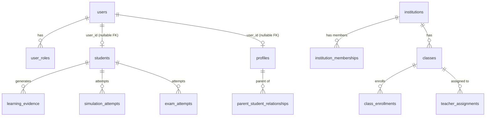

# 03 — Database Schema and Migrations

## Governance mechanism (real, unchanged since F0-S/F1 era)

`scripts/db-migrate.ts` applies every PENDING file in `database/migrations/*.sql`, each inside its own transaction, recorded into a ledger table only on success:

```sql
CREATE TABLE IF NOT EXISTS schema_migrations (
  version    TEXT PRIMARY KEY,
  name       TEXT NOT NULL,
  checksum   TEXT NOT NULL,
  applied_at TIMESTAMPTZ NOT NULL DEFAULT NOW()
);
```

Run via `npm run db:migrate` (or `-- --dry-run`). **Never invoked automatically** — not from `next build`, not from app startup, not from any deploy hook. This is a deliberate, standing design choice: a deploy can never accidentally alter schema.

## The 31-file migration history (chronological, real filenames)

```
20260831_1400_ai_execution_and_decision_audit.sql
20260901_1200_evidence_idempotency.sql
20260903_1000_misconception_lifecycle.sql
20260904_1000_intervention_lifecycle_concurrency.sql
20260905_1000_error_taxonomy_reconciliation.sql
20260906_1000_phase6_memory_state.sql
20260907_1400_phase7_transfer_state.sql
20260908_1000_phase7_transfer_task_instances.sql
20260909_1000_phase8_learning_plan.sql
20260910_1000_phase8_unavailable_dates.sql
20260915_1000_canon_r4r1_pedagogical_requirement_recognition.sql
20260915_1100_canon_r5r1_quiz_session_v1_marker.sql
20260915_1200_canon_r5r1a_quiz_session_authorized_contract.sql
20260916_1000_canon_r6_perf_r2_canonical_prepared_activity.sql
20260918_1000_f0s_ai_global_limits.sql
20260919_1000_f1_unified_identity.sql
20260920_1000_f2_institutions_relationships_permissions.sql
20260921_1000_f3_subscription_entitlement_foundation.sql
20260922_1000_f4_learning_architecture_2.sql
20260923_1000_f5_evidence_learner_state_2.sql
20260924_1000_f6_curriculum_standards_mapping.sql
20260925_1000_f7_assessment_framework_engine.sql
20260926_1000_f8_framework_aware_teaching_exam_skills.sql
20260927_1000_f9_exam_readiness_simulation.sql
20260928_1000_f11b_teacher_intervention_domain.sql
20260929_1000_f11c1_concept_reinforcement_execution.sql
20260930_1000_f11c2_skill_reinforcement_execution.sql
20261001_1000_f11c3_competency_reinforcement_execution.sql
20261002_1000_f11c4_exam_reinforcement_execution.sql
20261003_1000_f12_institution_intelligence.sql
20261010_1000_f15_min_cohort_policy.sql
```

Plus one non-file ledger row, `STUDYUS_BASELINE_2026_08` ("Live schema baseline (pg_dump snapshot, Phase 0D)") — the original `pg_dump` snapshot this entire history starts from (`database/baseline/STUDYUS_BASELINE_2026_08.sql`). **Total: 32 ledger entries when fully applied.**

## Current verified Preview database state — **LIVE VERIFIED**, 2026-09-20

| Metric | Value | How verified |
|---|---|---|
| Applied migrations | **32 / 32** (0 pending) | Live query via a temporary diagnostic route |
| Checksum drift | **0** | Same |
| Public tables | **132** | Same |
| `users`/`user_roles`/`institutions`/`schema_migrations` exist | **true / true / true / true** | Same |
| `studentsTotal` / `usersTotal` | **11 / 11** | Same |
| `profilesTotal` / `userRolesTotal` | **15 / 15** | Same |
| `user_roles` by role | **STUDENT: 11, PARENT: 4** | Same |
| `institutionsCount` | **0** | Same |
| Identity integrity: `studentsWithoutUser`, `profilesWithoutUser`, `studentBrokenLinks`, `profileBrokenLinks`, `duplicateClerkIds`, `duplicateUserRoles` | **all 0** | Same |

This is not asserted from the operator's own report — it was independently re-derived by querying the live diagnostic route directly and cross-checking the returned migration IDs against the repository's own 31-file list, name for name, in order.

## How this state was reached (real incident, not a hypothetical)

1. **Discovery**: the deployed Preview app failed every authenticated request with Postgres error `42P01 relation "users" does not exist`, found via `npx vercel logs`.
2. **Root cause, found by a temporary diagnostic route** (`src/app/api/diagnostics/preview-db/route.ts` — Preview-only, 404s elsewhere, never returns a connection string/hostname/credential, every query a read-only `to_regclass`/`COUNT(*)`/`SELECT`): a one-way SHA-256 fingerprint of `hostname|databaseName` proved the runtime Preview database was a **different** database from the one the operator had been separately migrating locally.
3. **Classification**: the runtime ledger (15 rows at the time) was queried live and matched, name-for-name, the first 14 repository migration files plus the baseline row — a genuine, non-corrupt, in-sequence prefix of the real history, arrested one file before `f0s_ai_global_limits`. This ruled out the "F1-identity-applied-but-`users`-missing" corruption pattern (F1 was simply absent from the ledger, consistent with `users` not existing yet — not a contradiction).
4. **Rehearsal**: the operator created a temporary Neon branch (`f15-migration-trial-20260919`, parented off Preview, auto-delete scheduled) and rehearsed the remaining 17 migrations there first.
5. **Repair**: the operator applied the same 17 migrations to the real runtime Preview database via the same governed `npm run db:migrate` runner used everywhere in this program. A second dry-run reported zero pending migrations.
6. **Independent re-verification**: the diagnostic route was queried a second time; the database fingerprint was unchanged (confirms an in-place repair of the same database, not a repoint to a different one), and `migrationIds` 16–32 matched the remaining repository files exactly.
7. **Identity backfill**: `runIdentityBackfill()` (the F1-era, already-certified, `ON CONFLICT DO NOTHING` idempotent backfill) was run twice; the second run produced zero writes, confirming idempotency in practice.

No connection string, hostname, username, or password was ever printed, logged, or committed during this process.

## Core schema shape (real tables, no ORM)

`users`/`user_roles` (F1, additive) sit alongside the pre-existing `students`/`profiles` tables — see [04_IDENTITY_ROLES_AND_AUTHORIZATION.md](04_IDENTITY_ROLES_AND_AUTHORIZATION.md) for the full identity model. Learning-domain tables (`concepts`, `learning_evidence`, `mastery_records`, `simulation_attempts`, `exam_attempts`, `readiness_snapshots`, `teacher_interventions`, `institutions`, etc.) all still key off `students.id`/`profiles.id`, never off `users.id` directly — F1's own explicit design choice to avoid a big-bang rewrite of every table.



## Pilot exam catalog seed — **LIVE VERIFIED**, 2026-09-21

A second real data gap was found after the migration/identity work above: `exam_definitions`/`exam_versions` had zero ACTIVE+PUBLISHED rows, and `canonical_subjects` was **completely empty** — blocking Student A's self-service Exam Profile flow entirely. An idempotent, Pilot-only seed (`src/lib/assessment/pilot-catalog-seed.service.ts`) closed this, reusing only already-certified F4/F6/F7 services:

| Metric | Before | After |
|---|---|---|
| `activeExamDefinitionCount` | 0 | **1** ("PAA Mathematics (Pilot)") |
| `publishedExamVersionCount` | 0 | **1** ("Pilot 2026 v1") |
| `publishedBlueprintCount` | 0 | **1** |
| `canonical_subjects` rows | 0 | **1** (Mathematics, operator-authorized) |
| `students`/`users`/`profiles`/`institutions`/`institution_memberships` | 11/11/15/0/0 | **unchanged** |

16 entities created in total (org → programme → subject → structure version/node → learning objective → canonical subject/concept → objective-concept mapping → exam definition → scoring model → exam version → component → blueprint → allocation → target), each looked up by natural key first (idempotent — a second `--write` run created zero new rows, reusing identical ids). Full manifest, operator authorization record, and a documented (never-executed) rollback procedure: `docs/implementation/f15/F15_PILOT_EXAM_CATALOG_SEED_MANIFEST.md`.

**A real bug was found and fixed before any write was attempted**: the seed's own dry-run mode silently truncated its reported plan whenever a parent entity didn't exist yet (an `undefined` id caused every downstream step to be skipped without even being logged) — fixed with a cascading placeholder id (the nil UUID), which lets every downstream natural-key check still run safely (matching zero real rows) while correctly reporting what it too would create.

**Deliberately left unattached**: the exam version's `scoring_model_id` — a real, honest fact (no finalized PAA scoring formula exists for this pilot yet) that correctly keeps `FULL_MOCK` reporting `NOT_READY` via the existing, unmodified `canFullMockBeOffered()` guard, while `TOPIC_EXAM`/`DOMAIN_EXAM`/`MINI_MOCK` (which never depend on a scoring model) are genuinely eligible.

**[FASE 0 FREEZE — 2026-09-21]**: "genuinely eligible" above is correct and unchanged as a statement about the `canFullMockBeOffered()` guard — those three modes are not blocked by the missing scoring model. It is **not** a statement about content sufficiency, and a manual attempt the same day showed it cannot be read that way: `MINI_MOCK` returned only 1 question, with no equivalent concept match and no resolvable content ("Todavía no se encontró un concepto equivalente para ti", skip-only). Being guard-eligible and being academically usable are two different claims; only the first is verified here. See `docs/implementation/f15/F15_PHASE0_ACCEPTANCE_FREEZE.md`.

## Pilot data growth (reasoned, not load-tested)

`simulation_attempts.navigation_state` (JSONB) holds the full pending generated-question object during an active exam attempt, cleared on submission — a real but modest per-attempt storage characteristic, not expected to be a capacity concern at pilot scale.

## What is explicitly not yet done here

- **No backup/restore automation exists** — see [11_BACKUP_RESTORE_AND_ROLLBACK.md](11_BACKUP_RESTORE_AND_ROLLBACK.md). **DEFERRED**, owner: Database operations.
- **Load/concurrency characterization at the database layer** — **DEFERRED**, rolls into the authenticated E2E session's own latency/load observations where feasible.
