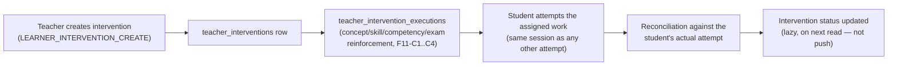

# 06 — Exam, Readiness, and Interventions

## Assessment framework (F7)

`assessment_blueprints` define the shape of an exam (`blueprint_component_allocations`, `blueprint_objective_targets`). `exam_definitions`/`exam_versions` are concrete, versioned exams built against a blueprint. This is the formal contract every exam in the system — practice or official — is evaluated against. **TESTED**: 14-case real-Postgres adversarial certification, zero fixes needed on first run (F7).

## Exam-readiness simulation (F9)

`simulation_plans` define a target readiness assessment; `simulation_attempts` track a student's actual attempt against it; `readiness_snapshots` (versioned via `readiness_policy_versions`) are the computed readiness score at a point in time. `computeReadinessSnapshot`/`recordSimulationItemResponse` are the canonical, single source of truth for grading — every later consumer (F14/F15's exam-taking UI, F12's institution aggregates) delegates to these, never re-implements them. **TESTED**: adversarial + concurrency + performance real-Postgres certification (F9).

## Item-by-item exam-taking (F15)

Closed F14's own principal disclosed gap. `item-resolution.service.ts` wires `SimulationPlanTarget` to actual question content (a real architectural gap found and closed by *reusing* F9's grading rather than building a parallel exam engine). `ItemRunner.tsx` is the UI. **Scope limit, disclosed**: only `UNTIMED` attempts are tested and should be offered to pilot users; `TRAINING_TIMED`/`OFFICIAL_SIMULATION_TIMED` are accepted at attempt-start but have no enforcement or countdown UI yet (**DEFERRED**, see [15_RESIDUAL_RISKS_AND_IVG.md](15_RESIDUAL_RISKS_AND_IVG.md)).

## Teacher interventions (F11-B/C1–C4)

**Reconciliation is intentionally lazy** — computed on next read of the intervention's status, not pushed synchronously the moment a student finishes. This is a disclosed, by-design characteristic (not a bug): a Teacher checking immediately after a Student finishes may see a brief delay before the status updates, refreshed on their next page load. **TESTED**: F11's own integrated certification (44 real-Postgres assertions across 10 sections).

## Institution-level aggregates (F12)

Diagnostics/Interventions/Coverage/Readiness institution-wide summaries, each cohort-size-suppressed via MIN_COHORT_POLICY (minimum 10 students) so no individual result can be backed out of a too-small aggregate. Two real gaps were found and fixed in F15 (`getInstitutionDiagnosticSummary`/`getInstitutionInterventionSummary` had shipped without the same suppression their sibling metrics already had). **TESTED**: F12's own real-Postgres certification, re-verified after the MIN_COHORT_POLICY migration.

## Exam session integrity (negative authorization)

Full chain traced: Teacher assignment → specific session → same-session execution → reconciliation → status update. A 9-case IDOR/negative-authorization matrix exists; 7 cases have real/unit evidence (2 new IDOR unit tests + 5 real-Postgres cases), 2 remain **DEFERRED** to live authenticated E2E (a student attempting to access another student's exam session by ID manipulation, and a cross-institution teacher-assignment attempt) — see [15_RESIDUAL_RISKS_AND_IVG.md](15_RESIDUAL_RISKS_AND_IVG.md).

## Status summary

| Component | Status |
|---|---|
| Assessment framework, readiness simulation, exam-taking | **IMPLEMENTED, TESTED** |
| Teacher intervention lifecycle | **IMPLEMENTED, TESTED** |
| Institution aggregates + cohort suppression | **IMPLEMENTED, TESTED** |
| Timed exam modes | **DEFERRED** — do not offer to real pilot users |
| Full exam-session negative-authorization matrix | **PASS (7/9 TESTED); DEFERRED (2 cases, live-only)** |
| Live authenticated exam start → answer → finish → reconciliation | **BLOCKED pending operator-assisted login** (part of the E2E matrix in [13_PILOT_RUNBOOK.md](13_PILOT_RUNBOOK.md)) |
