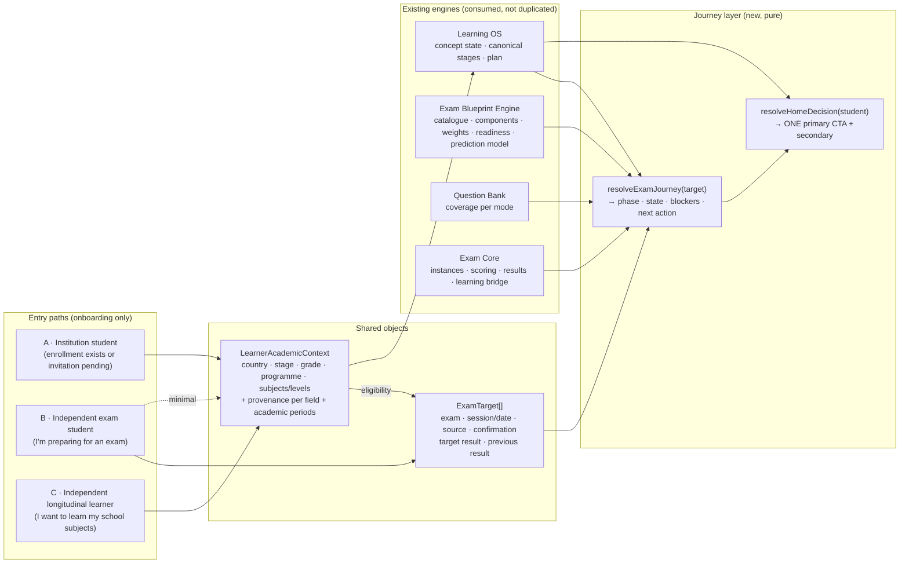
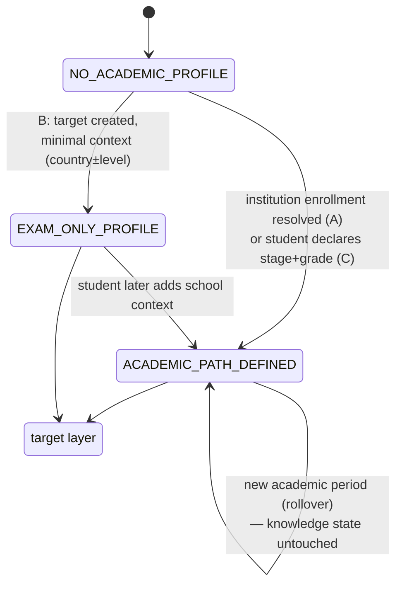
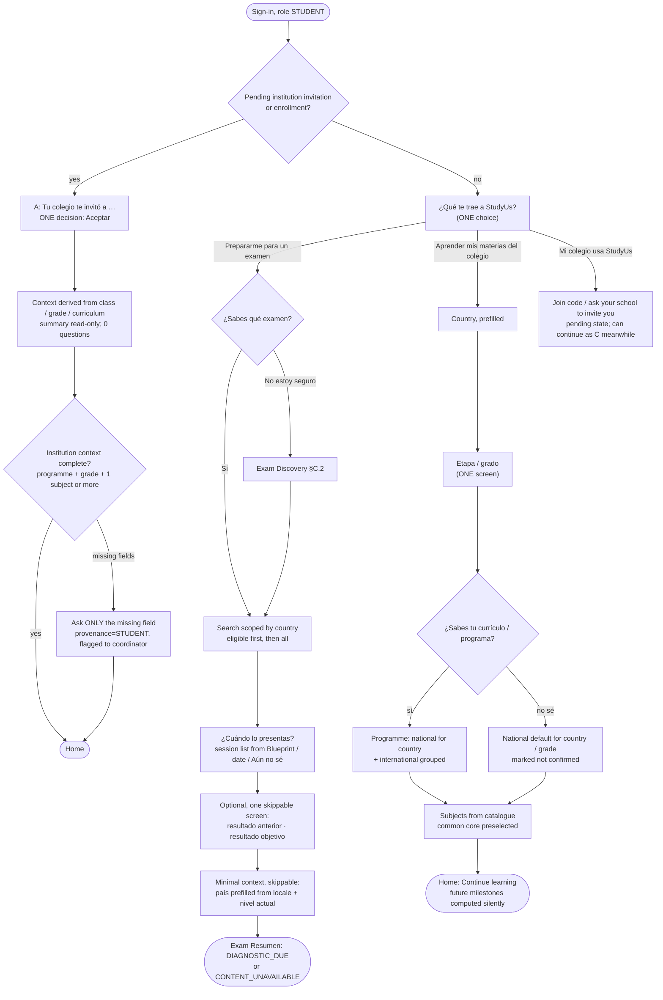

# Student Exam Journey V2 — architecture, state machine, decision tree, data contracts

- **Status:** design certified at `edb63dc8`. Section O decisions O-01 to O-07 are **APPROVED** (§O). J0 (exam-only access) and J2 (journey resolver, shadow mode) are implemented on this branch (§P) and shadow-validated locally against real DEV data and an ephemeral copy: `LOCAL_SHADOW_VALIDATED` (see [`STUDENT_EXAM_JOURNEY_V2_SHADOW_VALIDATION.md`](STUDENT_EXAM_JOURNEY_V2_SHADOW_VALIDATION.md)). No new UX, no migration, no deploy.
- **Base:** `bf98086` · branch `design/student-exam-journey-v2`.
- **Read first:** [`00_STUDENT_EXAM_JOURNEY_CURRENT_STATE.md`](00_STUDENT_EXAM_JOURNEY_CURRENT_STATE.md). Gap IDs `G-xx` refer to it.
- **Scope rule:** this track decides **what the student sees and does next**. It **consumes** the Exam Blueprint Engine (what the exam is and how it is scored) and the Question Bank (what can be executed). It never invents an academic rule. When a dependency is missing it shows an explicit state (`BLUEPRINT_INCOMPLETE`, `CONTENT_UNAVAILABLE`, `PREDICTION_MODEL_UNAVAILABLE`, …).

Contents:
- A Journey Architecture
- B State Machine
- C Decision Tree
- D Institutional Journey
- E Independent Exam Journey
- F Independent Longitudinal Journey
- G Exam Preparation Journey
- H Prediction Journey (IB)
- I Home / CTA rules
- J Empty / Error / Not-ready states
- K UX Wireflow
- L Data Requirements
- M Acceptance Scenarios
- N Implementation proposal
- O Decisions (O-01 to O-07 approved)
- P Implementation status (J0, J2)

---

## Design principles turned into rules

| # | Principle | Enforceable rule |
|---|---|---|
| P1 | Don't ask what we already know | Every academic field has a **provenance**. A field with provenance `INSTITUTION` is shown read-only ("Lo indicó tu colegio") and never asked. |
| P2 | One main decision per onboarding step | Each onboarding screen has exactly one required input. Everything else is optional or deferred. |
| P3 | No unnecessary catalogues | Exam choice is always **scoped first** (assigned → eligible → search). The full catalogue is only reachable through search. |
| P4 | Never hide why something is recommended | Every recommended exam and every Home CTA carries a `reason` code with a student-readable sentence. |
| P5 | Explain what comes next | Every exam screen shows the **journey stepper**: current step, next step, and the condition to reach it. |
| P6 | Learning ≠ exam preparation | Exam preparation activates by **preparation window**, not by the existence of an exam. Far-future exams are milestones, never the main CTA. |
| P7 | Continuity | Knowledge state is never reset. A new year, curriculum or target reads the same history, weighted by recency and retention. |
| P8 | Progress, not just scores | Every result screen shows change against the previous attempt and the next action, not only the number. |
| P9 | No unnecessary anxiety | No countdown outside the preparation window. No red urgency colour. Projections are always ranges with a "how to improve" action. |
| P10 | Projected ≠ official | Projection UI has a fixed visual treatment (dashed frame, "Proyección StudyUs" label, basis line) that is never used for official or teacher grades. |
| P11 | One engine | All three entry paths produce the same two objects (`LearnerAcademicContext`, `ExamTarget[]`) and run the same resolvers. There is no path-specific journey logic. |

---

## A. Journey Architecture

### A.1 The idea: three entries, two objects, one resolver



**What differs between the paths is only how the two objects get filled:**

| | LearnerAcademicContext | ExamTarget[] |
|---|---|---|
| **A · Institution** | Derived from enrollment → class → grade → institution curriculum. Provenance `INSTITUTION`. The student confirms nothing they don't own. | `class_exam_assignments` are materialised automatically as targets (`source=INSTITUTION`, `confirmation=ASSIGNED`). The student may add personal targets. |
| **B · Independent exam** | **Minimal**: country + current level (1 step, optional skip). The full academic profile is *not* required. | Created first, by "I know my exam" or Exam Discovery. Internally mapped to requirements → concepts by the Blueprint Engine / learning bridge. |
| **C · Longitudinal** | Declared by the student (country → stage → grade → programme if known → subjects). Provenance `STUDENT`. Rolled forward each school year. | Usually none at the start. Eligibility produces **future milestones** (`confirmation=SUGGESTED`) which become targets when the preparation window opens or the student confirms. |

After onboarding, there is **no path flag** anywhere in the product. Behaviour depends on the data (provenance, targets, phase), never on "which door the student came in". A student can move from C to A (joins a school) or add a B-style target (Case 7) without migration.

### A.2 Layering

| Layer | Owns | Does NOT own |
|---|---|---|
| **Blueprint Engine** (Track B / other track) | Exam catalogue, versions, sessions, components, weights, max marks, assessment type (external/internal), boundaries or conversion model + provenance and O-02 classification, readiness ladder, sessions / dates, prerequisites, structural rules, real exam restrictions, eligibility rules | What the student does next, and **when** to recommend preparation (O-01) |
| **Question Bank** | Item inventory, usage eligibility per mode, coverage, health | Whether the student *should* take a mock |
| **Exam Core** | Instances, delivery, scoring, results, learning bridge | Sequencing (Mock 1 → reinforcement → Mock 2) |
| **Learning OS** | Concept state, canonical stages, plan, Today ranking | Exam phases |
| **Journey layer (this track)** | Academic context resolution, targets lifecycle, journey state, home decision, preparation pacing (windows, mock guidance: O-01, O-04), projection *assembly* (combining Blueprint model + Exam Core results + estimates), UX states | Academic rules, scales, boundaries, item selection |

### A.3 Information architecture (validated proposal)

The brief's proposed IA (Today / My Learning / Subjects / Progress / Exam Preparation → Overview, Preparation, Practice, Mocks, Prediction, Results) was checked against the states and the cases.

**Kept:**
- Exam preparation as a first-class section.
- One space per exam target.

**Changed, and why:**

| Proposal | Decision | Reason |
|---|---|---|
| Exam Preparation always in main nav | **Conditional primary tab "Exámenes"**. It is primary when ≥1 target is in phase `ACTIVATION` or later; otherwise it sits under "Más". | P6: a Year 7 student must not see an exam tab next to "Aprender". Today exam prep is buried under "Más" (G-12), which is wrong for a DP2 student. The phase decides. |
| Separate "Subjects" and "My Learning / Mi Ruta" | **Keep the current "Aprender"** (subjects → topics → concepts, path map inside). | They already share one snapshot. Splitting adds a decision without new information. |
| 6 tabs per exam (Overview, Preparation, Practice, Mocks, Prediction, Results) | **4 tabs**: Resumen · Preparación · Simulacros · Proyección. "Practice" and "Exam Training" live inside Preparación as two clearly badged blocks. "Results" merges into Proyección as the timeline *Proyección StudyUs → Predicted (profesor) → Resultado oficial*. | On mobile 6 tabs don't fit. Practice without a plan context is the anti-pattern we want to avoid. Results only make sense against the projection history (P8). |
| Tabs always visible | **Tabs appear by phase.** Simulacros appears at `MOCK_AVAILABLE` (before that, the stepper says "Se desbloquea cuando…"). Proyección appears at the first projection *or* when the Blueprint has a prediction model (so the student sees what is needed). | P5 + P6: don't show empty functions. Always explain what comes next. |
| "Mi plan" vs "Plan de estudio" | Out of scope here, but the journey **reads only one plan** (Learning OS plan), and flags the merge as a dependency. | G-12. |

Resulting student navigation:

```
Primary (mobile tabs):  Inicio · Aprender · [Exámenes — only when a target is active] · Progreso
Más:                    Tutor · Mi plan · Exámenes (when not primary) · Mejorar · …
Exámenes → Mis exámenes (list, incl. future milestones) → {exam}
             {exam}:  Resumen | Preparación | Simulacros* | Proyección*      (* by phase)
```

---

## B. Student State Machine

### B.1 Two levels of state

1. **Learner state:** one per student. It describes the academic context and whether any target exists.
2. **Target journey state:** one per `ExamTarget`. A student with IB May 2027 and PAA Oct 2026 has two independent journey states. Home arbitrates between them (§I).

Both are **derived**, never hand-set. This is the same pattern as the canonical pedagogical engine: they are recomputed from facts (profile, enrollment, targets, instances, results, estimates, dates, capabilities). Only **facts** are stored. A transition log is kept for audit and analytics (§L.3), never read back as the source of truth.

### B.2 Learner-level states



`EXAM_ONLY_PROFILE` is an addition to the brief's list. It is required so that Path B never has to build a school curriculum (fixes G-01). `NO_EXAM_TARGET` / `FUTURE_EXAM_IDENTIFIED` are evaluated *per student* (are there targets?) and then per target.

### B.3 Target-level phases and states

The 24 states in the brief are grouped into **7 phases**. The phase drives navigation and Home priority. The state drives the exact screen and CTA.

| Phase | States | Meaning |
|---|---|---|
| `NONE` | `NO_EXAM_TARGET` | No target (student-level). |
| `HORIZON` | `FUTURE_EXAM_IDENTIFIED`, `EXAM_PREPARATION_NOT_DUE`, `FOUNDATION_BUILDING` | The exam is known but far away. Learning drives everything, and the exam is a milestone. |
| `ACTIVATION` | `EXAM_READINESS_AVAILABLE`, `DIAGNOSTIC_DUE` | The preparation window is open. Find out where the student stands. |
| `PREPARATION` | `PREPARATION_ACTIVE`, `PRACTICE_ACTIVE`, `PAPER_TRAINING` | Closing gaps: learning + practice + format training. |
| `SIMULATION` | `MOCK_AVAILABLE`, `MOCK_1_COMPLETED`, `EARLY_PREDICTION_AVAILABLE`, `REINFORCEMENT_ACTIVE`, `MOCK_2_AVAILABLE`, `MOCK_2_COMPLETED`, `UPDATED_PREDICTION_AVAILABLE` | Mocks under exam rules, and reinforcement between them. |
| `PROJECTION` | `ADDITIONAL_COMPONENTS_REQUIRED`, `FULL_PREDICTION_AVAILABLE` | Completing the picture with non-simulated components (IA, coursework). |
| `CLOSING` | `FINAL_PREPARATION`, `EXAM_READY`, `EXAM_COMPLETED`, `RESULT_RECORDED` | Final weeks, the exam itself, and the result loop back into learning. |

**Blockers are orthogonal to states.** A blocker never replaces the state. It explains why an action **cannot** happen (O-04: a recommendation is never a blocker). Names below are the implemented codes (`src/lib/exam-journey/types.ts`):

| Blocker | Raised when | Typical effect |
|---|---|---|
| `BLUEPRINT_INCOMPLETE` | Blueprint readiness < `STRUCTURE_READY`, or no published version for the session | The target stays in `HORIZON`/`ACTIVATION`, and learning continues on the mapped concepts |
| `BLUEPRINT_VERSION_INVALID` | The syllabus / version is known to be invalid for the target | No practice or mock on that version |
| `CONTENT_UNAVAILABLE(mode)` | QB/capabilities say the mode can't run (`STRUCTURE_ONLY`, `BANK_IN_PROGRESS`, `PRACTICE_ONLY`), or the content facts are missing | The diagnostic, practice or mock step is replaced by "en preparación" with a notify option |
| `INSTITUTIONAL_RELEASE_REQUIRED` | An institution-gated exam not yet released to the student | The mock cannot start |
| `ATTEMPT_IN_PROGRESS` | Exam Core allows one open attempt per preparation | Resume first |

A reduced mock form is **not** a blocker: the mock runs, labelled "Simulacro reducido", and counts toward the sequence with fidelity `REDUCED` (reason `MOCK_REDUCED_FORM_ONLY`).

| `PREDICTION_MODEL_UNAVAILABLE` | O-02 `NO_MODEL`: the Blueprint gives no classified conversion/boundary model (today: **all exams**, G-03) | Prediction states are skipped. Results show performance by component, never a grade |
| `PREDICTION_NOT_READY` | A model exists, but the evidence does not support a projection (no scored mock, or no mock covering the simulated components) | Results by component; the projection waits for the evidence |
| `NO_CONCEPT_MAPPINGS` | Learning bridge has 0 mappings | Reinforcement after a mock is limited to practice by area |
| `REQUIRED_COMPONENT_MISSING` | The prediction model has non-simulated components without a usable estimate (O-03: an institution student's own estimate does not count) | The state is `ADDITIONAL_COMPONENTS_REQUIRED` |
| `EXAM_DATE_UNKNOWN` | No date and no session | Phase is computed as if the exam were outside the window, plus a "set your date" secondary CTA |
| `ACADEMIC_CONTEXT_CONFLICT` | Student-declared vs institution context disagree on programme/level for this target | Target shows "confirm with your school". No silent overwrite. *Deferred to J1 (needs `resolveLearnerAcademicContext`); not emitted by the J2 resolver.* |
| `TARGET_EXAM_UNCONFIRMED` | `confirmation = SUGGESTED / NOT_CONFIRMED` (Discovery) | The target is visible, but cannot leave `HORIZON` until the student confirms |

### B.4 State diagram (target level)

```mermaid
stateDiagram-v2
  direction TB
  [*] --> FUTURE_EXAM_IDENTIFIED: target created / suggested
  FUTURE_EXAM_IDENTIFIED --> EXAM_PREPARATION_NOT_DUE: confirmed & window not open
  EXAM_PREPARATION_NOT_DUE --> FOUNDATION_BUILDING: student has active learning<br/>on target-mapped concepts
  FOUNDATION_BUILDING --> EXAM_READINESS_AVAILABLE: window opens<br/>(date − prepWindow ≤ today)<br/>or student opts in early
  EXAM_PREPARATION_NOT_DUE --> EXAM_READINESS_AVAILABLE: window opens
  FUTURE_EXAM_IDENTIFIED --> EXAM_READINESS_AVAILABLE: confirmed & already inside window (Path B)

  EXAM_READINESS_AVAILABLE --> DIAGNOSTIC_DUE: canRunDiagnostic & no diagnostic<br/>& evidence on mapped reqs < threshold
  EXAM_READINESS_AVAILABLE --> PREPARATION_ACTIVE: enough prior evidence<br/>(diagnostic optional)
  DIAGNOSTIC_DUE --> PREPARATION_ACTIVE: diagnostic completed

  PREPARATION_ACTIVE --> PRACTICE_ACTIVE: practice sessions started
  PRACTICE_ACTIVE --> PAPER_TRAINING: component format training started<br/>(requirements ≥ NEEDS_CONFIRMATION ≥ X%)
  PREPARATION_ACTIVE --> MOCK_AVAILABLE: Mock gate passes (§G.4)
  PRACTICE_ACTIVE --> MOCK_AVAILABLE: Mock gate passes
  PAPER_TRAINING --> MOCK_AVAILABLE: Mock gate passes

  MOCK_AVAILABLE --> MOCK_1_COMPLETED: Mock 1 scored
  MOCK_1_COMPLETED --> EARLY_PREDICTION_AVAILABLE: prediction model present
  MOCK_1_COMPLETED --> REINFORCEMENT_ACTIVE: no prediction model<br/>(results by component only)
  EARLY_PREDICTION_AVAILABLE --> REINFORCEMENT_ACTIVE: reinforcement plan generated
  REINFORCEMENT_ACTIVE --> MOCK_2_AVAILABLE: Mock-2 gate passes (§G.5)
  MOCK_2_AVAILABLE --> MOCK_2_COMPLETED: Mock 2 scored
  MOCK_2_COMPLETED --> UPDATED_PREDICTION_AVAILABLE: prediction model present
  MOCK_2_COMPLETED --> REINFORCEMENT_ACTIVE: no prediction model
  UPDATED_PREDICTION_AVAILABLE --> ADDITIONAL_COMPONENTS_REQUIRED: model has non-simulated<br/>components without estimate
  UPDATED_PREDICTION_AVAILABLE --> FULL_PREDICTION_AVAILABLE: all components covered
  EARLY_PREDICTION_AVAILABLE --> ADDITIONAL_COMPONENTS_REQUIRED: (allowed early, secondary CTA)
  ADDITIONAL_COMPONENTS_REQUIRED --> FULL_PREDICTION_AVAILABLE: estimates entered<br/>(student / teacher)
  FULL_PREDICTION_AVAILABLE --> REINFORCEMENT_ACTIVE: further mocks (Mock n) loop

  PREPARATION_ACTIVE --> FINAL_PREPARATION: date − finalWindow ≤ today
  REINFORCEMENT_ACTIVE --> FINAL_PREPARATION: date − finalWindow ≤ today
  FULL_PREDICTION_AVAILABLE --> FINAL_PREPARATION: date − finalWindow ≤ today
  UPDATED_PREDICTION_AVAILABLE --> FINAL_PREPARATION: date − finalWindow ≤ today
  FINAL_PREPARATION --> EXAM_READY: date − readyWindow ≤ today (last days)
  EXAM_READY --> EXAM_COMPLETED: exam date passed & student confirms "I took it"<br/>(or institution marks the session sat)
  EXAM_COMPLETED --> RESULT_RECORDED: actual result entered (student-reported / verified)
  RESULT_RECORDED --> [*]: target archived (history kept);<br/>gaps → learning; optional retake → new target
```



**Not every exam passes through every state.** The resolver chooses the reachable states per target from the Blueprint capabilities:

| Exam profile | States actually used |
|---|---|
| IB DP subject (HL/SL) with IA, prediction model available | All, including `ADDITIONAL_COMPONENTS_REQUIRED` |
| IB DP subject, **no** prediction model (today) | Up to `MOCK_2_COMPLETED`. Prediction states are skipped (blocker `PREDICTION_MODEL_UNAVAILABLE`). `PROJECTION` phase is hidden |
| PAA (reduced mock only, no scale today) | `ACTIVATION` → `PREPARATION` → `SIMULATION` with a reduced form (`MOCK_REDUCED_FORM_ONLY`). No prediction states. `CLOSING` |
| Saber 11 / ICFES (retake) | As PAA. `previous_result` seeds the starting point. The Diagnostic may be skipped if the previous result + evidence are rich (it is still offered) |
| Cambridge Checkpoint (Year 9), low stakes | `HORIZON` → `ACTIVATION` → light `PREPARATION` → optional single mock → `CLOSING`. No Mock 2, no prediction (policy `lowStakes=true`) |
| Exam with structure only (`STRUCTURE_READY`) | `HORIZON` → `ACTIVATION` with `CONTENT_UNAVAILABLE`. Learning on mapped concepts, nothing more |
| AICE Diploma (programme plan) | The programme target is a container. Each subject (AS/A) is its own target with its own journey |

### B.5 Transition table (guards)

All thresholds marked ⚙ are **journey policy** (UX pacing), versioned in `src/lib/exam-journey/policy.ts` (`journey-policy-v1`). Per **O-01** they are never Blueprint data and never exam-specific: the Blueprint supplies the facts (date/session, components, availability), the journey decides the pacing from the date, readiness, evidence and the intensity required. The preparation window is `8 + 18 × gapShare` weeks, where `gapShare` = 1 − weighted ready share (unknown = 1). **This window is an `EXPERIMENTAL_PRODUCT_HEURISTIC`** (`journey-policy-v1`): versioned, replaceable, visible in every `WINDOW_*` resolution reason, never an academic rule and never a hard block.

| From → To | Guard (all must hold) | Facts read |
|---|---|---|
| — → `FUTURE_EXAM_IDENTIFIED` | target exists (any source) | `exam_targets` |
| `FUTURE_EXAM_IDENTIFIED` → `EXAM_PREPARATION_NOT_DUE` | `confirmation ∈ {CONFIRMED, ASSIGNED}` ∧ `today < windowStart` | target, journey policy window ⚙ (O-01), readiness |
| `…NOT_DUE` → `FOUNDATION_BUILDING` | ≥1 target-mapped concept has canonical evidence in the last 30 days ⚙ | learning bridge mappings, canonical stages |
| → `EXAM_READINESS_AVAILABLE` | `today ≥ windowStart` **or** student "Empezar a prepararme ahora" (opt-in, logged) ∧ Blueprint ≥ `STRUCTURE_READY` | dates, capabilities |
| → `DIAGNOSTIC_DUE` | `canRunDiagnostic` ∧ no completed diagnostic for this target ∧ (mapped requirements with evidence < 50 % ⚙) | preparation plan counts (existing `nextStep` rule) |
| → `PREPARATION_ACTIVE` | diagnostic completed **or** evidence ≥ 50 % ⚙ **or** `!canRunDiagnostic` (then blocker `CONTENT_UNAVAILABLE(DIAGNOSTIC)`) | — |
| → `PRACTICE_ACTIVE` | ≥1 PRACTICE instance completed for the target since activation | `exam_instances` |
| → `PAPER_TRAINING` | ≥1 component-scoped (paper/section) instance with `timing_mode ∈ {TRAINING_TIMED, OFFICIAL_SIMULATION_TIMED}` | `exam_instances.focus` |
| → `MOCK_AVAILABLE` | **Mock gate**, §G.4 | capabilities, plan, instances, dates |
| → `MOCK_1_COMPLETED` | first MOCK instance with result `SCORED`, fidelity ≥ policy minimum | `exam_attempt_results` |
| → `EARLY_PREDICTION_AVAILABLE` | Blueprint `predictionModel.status = AVAILABLE` ∧ projection computed | `exam_projections` |
| → `REINFORCEMENT_ACTIVE` | reinforcement plan for mock *n* exists (generated on scoring) | `exam_reinforcement_plans` |
| → `MOCK_2_AVAILABLE` | **Mock-2 gate**, §G.5 | — |
| → `ADDITIONAL_COMPONENTS_REQUIRED` | prediction model lists components with `simulated=false` and no current estimate | `exam_component_estimates` |
| → `FULL_PREDICTION_AVAILABLE` | every component has mock evidence or a current estimate | — |
| → `FINAL_PREPARATION` | `examDate − today ≤ finalWindowDays` (21 ⚙) | dates |
| → `EXAM_READY` | `examDate − today ≤ readyWindowDays` (3 ⚙) | dates |
| → `EXAM_COMPLETED` | `today > examDate` (or the profile is `COMPLETED`). Sat confirmation decides the next action: `CONFIRM_EXAM_SAT` until confirmed, then `RECORD_RESULT` | `exam_targets.sat_confirmed_at` |
| → `RESULT_RECORDED` | an `ACTUAL_RESULT` external grade exists | `exam_external_grades` |

**Dates:** the exam date comes from `target.examDate`. If that is absent, it comes from `session → Blueprint session calendar` (e.g. IB `M27`). If both are absent, the blocker is `EXAM_DATE_UNKNOWN`, and the target is treated as outside the window (the student can still opt in).

---

## C. Decision Tree — what StudyUs asks, and when

### C.1 Onboarding



**Rules:**
- **One required input per screen.** Optional inputs are on their own screen with a visible "Omitir".
- **The academic-year field disappears.** It is derived from country + today's date (school calendar per country, Blueprint/curriculum metadata). The student is asked only in the rare ambiguous case (southern-hemisphere calendars, `OTHER` country).
- **Subjects are chosen once.** Catalogue subjects (`student_academic_subjects`) become the student's learning subjects (fixes G-10).
- **Path B never sees the subject picker.** Subjects are created from the target's mapped concepts when the first learning activity is launched.
- **The gate** (fixes G-01) becomes: `READY` if the student has (complete context **or** ≥1 confirmed target **or** an active enrollment) **and** (≥1 subject **or** ≥1 target). `/dashboard/notifications` and invitation acceptance are always reachable.

### C.2 Exam Discovery ("I don't know which exam I need")

Each step is one question. The tree stops as soon as the candidate set is ≤3.

| Step | Question | Source of options | Skippable |
|---|---|---|---|
| 1 | País donde vas a estudiar / presentar | locale, profile | no |
| 2 | ¿Para qué lo necesitas? — Ingresar a la universidad · Terminar el colegio / título · Posgrado · Certificar un idioma · Solo practicar | fixed list | no |
| 3 | ¿En qué nivel estás ahora? | stage/grade list for country | yes if profile has it |
| 4 | ¿Tienes una universidad o programa objetivo? (free text, optional) | — | yes |
| 5 | ¿Sigues un currículo? (IB, Cambridge, nacional…) | profile/catalogue | yes if known |
| 6 | ¿Cuándo planeas presentarlo? | sessions from Blueprint | yes |

**Output:** at most 3 suggestions. Each one carries:
- the **reason** (eligibility reason codes already exist: `COUNTRY_GRADE`, `CURRICULUM`, `GRADE`, …), as a sentence;
- what StudyUs can do for it today (`objectiveStatusKey`);
- **if a target institution was given**: always "Confirma los requisitos con {institución}". StudyUs has no verified admission-requirements data, so it never says "{Universidad} requiere X". A suggestion created this way is saved with `confirmation = NOT_CONFIRMED` and the label "Examen objetivo no confirmado" until the student confirms.

If no rule matches: "No encontramos un examen claro para tu caso" → search the full catalogue + "Confirm with your institution". The engine never guesses.

### C.3 What is asked later (progressive, never in onboarding)

| Ask | When | Why then |
|---|---|---|
| Exam date / session | When the target enters `HORIZON` without a date, as a secondary card, at most once per 14 days ⚙ | It is needed for the window. Asking at onboarding causes drop-off |
| Target result | After the diagnostic (`PREPARATION_ACTIVE`), optional | The student can now set a realistic target |
| Previous result | Onboarding B4 (optional) **or** later on Resumen | Retakers (Case 5) want to give it at once |
| Component estimate (IA marks) | `ADDITIONAL_COMPONENTS_REQUIRED` only, and only if the student is not institution-linked for that subject or the teacher hasn't provided it within 14 days ⚙ | §H |
| "Did you sit the exam?" | First visit after `examDate` | `EXAM_COMPLETED` |
| Actual result | When the official result date for the session passes (Blueprint calendar) **or** the student opens Proyección | `RESULT_RECORDED` |
| Year rollover "¿Pasaste a {grado+1}?" | First visit after the country's school-year start (Path C only; A comes from the institution) | §F.3 |

---

## D. Institutional Journey (Path A) — end to end

**Actors:** coordinator / teacher (institution side, Track A), student.

1. **Institution setup (exists):** grade (`academic_programme_id`, `academic_year`), class → `institution_curriculum_id`, class subject, `class_exam_assignments(objective_key)`.
   - **New field requested:** `exam_session` on the assignment (e.g. `M27`), or on the grade for curriculum exams.
2. **Invitation:** email invitation (exists) **plus** a class join code (new), so a student without an account can join after sign-up. A pending invitation is shown **before** any onboarding (C.1 Q0).
3. **Context resolution:** `resolveLearnerAcademicContext` derives the following, all with provenance `INSTITUTION`:
   - country (institution)
   - stage/grade (`grades`)
   - programme (`institution_curricula`)
   - subjects + levels (class → academic subject, e.g. *Mathematics AA HL*)
   - academic year (`grades.academic_year`)
4. **Targets:** each active `class_exam_assignment` becomes an `ExamTarget` (`source=INSTITUTION`, `confirmation=ASSIGNED`, session from the assignment). The student cannot delete it, only hide it from Home (the teacher still sees it).
5. **Journey:** same resolver as everyone else.
   - Institution-specific additions:
     - teacher-provided **component marks** (IA) feed `exam_component_estimates` with source `TEACHER_ESTIMATE` / `TEACHER_MARKED`;
     - teacher **predicted grade** is stored as a separate external grade;
     - the institution may record official results (`INSTITUTION_VERIFIED`).
   - Teacher interventions (F11c4 exam reinforcement) appear in Preparación as "Asignado por tu profesor".
6. **Conflict:** if the student also declared a personal context that disagrees (e.g. says SL, class says HL), the target shows `ACADEMIC_CONTEXT_CONFLICT` with "Confirma con tu colegio". The coordinator sees the flag. There is no silent overwrite.
7. **Leaving the institution:** enrollment ends, so the provenance of the derived fields becomes `INSTITUTION_HISTORICAL`, and they become student-editable. Targets with `source=INSTITUTION` become `source=STUDENT` (kept, not deleted). Knowledge state is untouched.

**Case 1 (IB, years before DP)** and **Case 2 (DP Year 2)** are the same path at different phases. See §M.

---

## E. Independent Exam Journey (Path B) — end to end

```
Sign-in → "Prepararme para un examen" → know / discover → exam → session/date
  → (optional) previous / target result → (optional) country+level
  → Exam Resumen [DIAGNOSTIC_DUE]
  → Diagnostic (PRACTICE, untimed, explained as "no cuenta como nota")
  → Diagnostic result: strengths / gaps by requirement → plan generated
  → Preparación [PREPARATION_ACTIVE]: daily mix = learning on gap concepts (Learning OS) + practice + paper training
  → Mock gate → Simulacro 1 (instructions → environment → scoring → analysis)
  → Reinforcement plan (2 weeks ⚙) → Mock-2 gate → Simulacro 2 → comparison
  → Final preparation → Exam day → "¿Lo presentaste?" → Result → back to learning / retake target
```

**Internal mapping (invisible to the student):** target → Blueprint requirements (objectives) → learning bridge mappings → concepts (canonical). Learning activities created for a Path B student live in **auto-created subjects** named after the exam areas (e.g. "PAA · Razonamiento matemático"). They are created lazily on first launch and linked to the catalogue, so the same concept states are reused if the student later declares a school curriculum. No school curriculum is ever required.

---

## F. Independent Longitudinal Journey (Path C) — end to end

### F.1 Setup

country → stage/grade → programme (or "no sé" = national default, not confirmed) → subjects. Then Home: "Continuar aprendiendo".

### F.2 Future milestones (silent)

Eligibility runs on the academic context and produces **suggested** targets for the next assessment points, e.g.:
- MX Secundaria 1 → PISA (age 15)
- Cambridge Lower Secondary → Checkpoint (Year 9)
- Colombian grade 9 → Saber 11 (grade 11)

They are shown only as a "Próximo hito" line on Progress and on the "Mis exámenes" list, with the reason. They never appear as a Home CTA while in `HORIZON`.

### F.3 Academic periods and rollover

- **New entity `student_academic_periods`:** one row per student per school year (grade, programme, subjects snapshot, provenance, start/end).
- **At the country's school-year start ⚙:** one card "¿Empezaste {grado+1}?" with one tap to confirm, or "No, sigo en {grado}" / "Cambié de programa".
  - Confirming closes the previous period and opens a new one.
  - Subjects roll forward to the next catalogue subjects where the catalogue defines the progression. Otherwise the student keeps the same subjects.
- **Knowledge state is never reset.** Each evidence row is attributed to the period in which it happened (by timestamp → period), so the history can say *"Dominaste ecuaciones lineales en Grado 7 (2026), última comprobación de memoria hace 3 semanas"*.

### F.4 Multi-year evidence → readiness (Knowledge History)

The concept ladder (stored as **milestones**, §L.3):

```
LEARNED → PRACTICED → INDEPENDENTLY_DEMONSTRATED (PROVE) → RETAINED (RETAIN) → TRANSFERRED → EXAM_EVIDENCE (per target)
```

These map one-to-one to the canonical stages already computed by the pedagogical engine. The new part is **persisting the moment each milestone was first reached**, plus the academic period, instead of only replaying.

**How the exam journey consumes it (replaces raw-count readiness, fixes G-07):**

| Evidence on a target-mapped concept | Treatment in the preparation plan | Action generated |
|---|---|---|
| RETAINED or TRANSFERRED, last retention check ≤ 120 days ⚙ ago | `ALREADY_STRONG` | none (spot-check inside mocks) |
| RETAINED/TRANSFERRED but last check > 120 days ⚙, or current forgetting risk high | `NEEDS_CONFIRMATION` | **Retention check** (10 items, independent): not relearning |
| INDEPENDENTLY_DEMONSTRATED only | `NEEDS_CONFIRMATION` | retention check after ≥3 days |
| LEARNED/PRACTICED only | `NEEDS_REINFORCEMENT` | continue canonical sequence (PROVE) |
| Misconception active | `NEEDS_REINFORCEMENT` + misconception tag | remediation |
| No evidence | `NO_EVIDENCE` | diagnostic sample / learn |
| Exam evidence on **this** target | weighs in for this target only | per "exam evidence is exam-specific" |

A concept mastered four years ago therefore **counts** (the student is not sent back to relearn it), but it **must be re-confirmed cheaply** before the exam. That is the longitudinal promise in one rule.

**Visual (concept page, "Historia"):** a vertical timeline grouped by academic period.

```
Grado 7 · 2026   ● Aprendido   ● Practicado   ● Demostrado sin ayuda
Grado 8 · 2027   ● Recordado (comprobación de memoria)
Grado 9 · 2028   ● Aplicado en un contexto nuevo
DP1 · 2030       ◐ Comprobación pendiente antes de tu examen IB (hace 2 años)
```

---

## G. Exam Preparation Journey

### G.1 The six modes — visual system (fixes G-11)

Every activity card, launch screen and result screen carries **one mode badge**. The mode is shown by text + icon + a consistent help indicator, never by colour alone (accessibility).

| Mode | Label es / en | Icon (concept) | Help | Timing | Counts as | Badge tone |
|---|---|---|---|---|---|---|
| **Learn** | Aprender / Learn | open book | Full (tutor, explanations) | none | learning evidence (supported) | neutral |
| **Practice** | Practicar / Practice | pencil + light bulb | Hints, worked steps | none | learning evidence (supported) | neutral-blue |
| **Independent** | Sin ayuda / On your own | person / solo | none | none / soft | canonical PROVE / RETAIN / TRANSFER | solid outline |
| **Exam Training** | Entrenamiento de examen / Exam training | target + paper | none, format feedback after | training-timed optional | exam-specific evidence (this target) | exam tone, outline |
| **Mock** | Simulacro / Mock exam | stopwatch + paper | **blocked** (tutor blocked by delivery policy) | official, hard | exam result + exam-specific evidence | exam tone, solid |
| **Projection** | Proyección StudyUs / StudyUs projection | trend line | — | — | interpretation, never evidence | **dashed frame** |

A help indicator line always reads one of: "Con ayuda" · "Sin ayuda" · "Reglas de examen". It reuses `LearningSupportStatus` SUPPORTED/INDEPENDENT and adds `EXAM_RULES`.

**Fix required (G-08):** responses from Mock / Exam Training must not feed the legacy knowledge-state understanding/application scores. They feed exam-specific evidence plus the learning bridge only.

### G.2 Diagnostic

- **Offered at `DIAGNOSTIC_DUE`.** Uses the existing `startPreparationDiagnostic` (PRACTICE, STANDARD, UNTIMED, `purpose=DIAGNOSTIC`).
- **Framing copy:** "No es una nota. Nos dice por dónde empezar." Approx. duration from the Blueprint.
- **Output:** requirement map (strong / to confirm / to reinforce / no evidence) → plan.
- **Skip rule:** a student with rich prior evidence (≥50 % ⚙ of mapped requirements with evidence) goes to `PREPARATION_ACTIVE`. The diagnostic stays available as "Comprobar mi punto de partida".

### G.3 Preparation → Practice → Paper Training

- **Plan** = the existing preparation plan, prioritised by `weight × gap` (already in `preparation-plan.ts`). The plan's **learning** items are pushed into the Learning OS plan (EXAM_GAP recommendations, existing), so Home's learning CTA naturally works on exam gaps. No second plan.
- **Practice** = PRACTICE instances by area/skill (adaptive level, existing).
- **Paper training** = component-scoped instances with training timing. It is offered when ≥60 % ⚙ of the component's requirements are ≥ `NEEDS_CONFIRMATION`. Copy: "Entrena el formato del Paper 1: tiempo, tipos de pregunta, calculadora."

### G.4 Mock gate (Mock 1)

`MOCK_AVAILABLE` requires **all** of the following:

| # | Condition | Owner of the fact |
|---|---|---|
| 1 | Blueprint: a published version for the target session, and the component(s) at ≥ `REDUCED_MOCK_READY` | Blueprint |
| 2 | QB: `canRunReducedMock ∨ canRunFullMock` (frozen form can be assembled; ENFORCE honoured) | QB / capabilities |
| 3 | Student: diagnostic done **or** evidence ≥50 % ⚙ | Journey |
| 4 | Student: ≥ 40 % ⚙ of weighted requirements ≥ `NEEDS_CONFIRMATION` **or** `examDate − today ≤ 8 weeks` ⚙ (time overrides readiness) | Journey |
| 5 | No open attempt for the target | Exam Core |

- **If 1 or 2 fail:** blocker `CONTENT_UNAVAILABLE(MOCK)` / `BLUEPRINT_INCOMPLETE`. The stepper shows "Simulacro: en preparación por StudyUs", and the student can ask to be notified.
- **If 3 or 4 fail (O-04, APPROVED):** the mock is *not recommended*, never locked. The stepper shows "Te recomendamos reforzar antes del Simulacro 1" with progress, and the student **can still start it** ("Quiero hacerlo igual", logged opt-in). Low readiness is never by itself a reason to block. Conditions 1–2 (and an institutional release, an invalid version or a technical incompatibility) are the only hard blocks.

**Mock journey screens:** Unlocked card → **Instrucciones** (duration, sections, tools, rules, "no tutor", fidelity disclosure REDUCED/FULL) → **Entorno de examen** (existing ItemRunner, delivery policy) → **Entrega** → **Puntuación** (processing state; REVIEW_REQUIRED items pending) → **Análisis** (by component, by requirement, time management, vs diagnostic) → **Plan de refuerzo**.

**Mock numbering:** derived. Mock *n* = the *n*-th MOCK instance of the target with a SCORED result, at fidelity ≥ policy minimum. Abandoned and invalidated attempts don't count. CHALLENGE mode never counts as a mock.

### G.5 Reinforcement → Mock 2

- On Mock *n* scoring, the system generates `exam_reinforcement_plans` (new, thin): the top weak requirements (by marks lost × weight), mapped to concept actions (learning bridge) + practice + paper training, with a **horizon** of 14 days ⚙ (or less if the exam is near).
- **Mock-2 gate:** (≥ 14 days ⚙ since Mock 1 **and** ≥ 60 % ⚙ of the reinforcement plan items attempted) **or** `examDate − today ≤ 4 weeks` ⚙. Same opt-in escape as Mock 1. *Policy v1 (J2), until reinforcement plans exist (J5): "≥ 1 completed preparation activity, or learning on the target concepts, since the last mock" replaces the 60 % criterion.*
- **After Mock 2:** a comparison screen.
  - Per component: Δ marks %.
  - Per requirement: improved / same / dropped.
  - Time use.
  - "Lo que cambió desde el Simulacro 1".
  - Progress is the headline, the score is secondary (P8).
- **Mock *n* > 2:** the same loop, allowed up to the final window.

### G.6 Final preparation, exam, result

- **`FINAL_PREPARATION`** (≤21 days ⚙):
  - The plan shrinks to: retention checks on `NEEDS_CONFIRMATION` concepts, timed paper training on the weakest component, and one last mock only if ≥14 days remain.
  - No new topics unless high-weight `NO_EVIDENCE`.
  - Calm copy.
- **`EXAM_READY`** (≤3 days ⚙): exam logistics checklist (Blueprint: tools, calculator policy, duration), light review, rest message. No mocks.
- **`EXAM_COMPLETED`:** "¿Cómo te fue?" (optional reflection), then wait for the result. Home returns to learning.
- **`RESULT_RECORDED`:** comparison *Proyección StudyUs vs Predicted (profesor) vs Resultado oficial* (when available). Exam-specific gaps go back to learning. Retake option → new target with `previous_result` prefilled (Case 5).

---

## H. Prediction Journey — IB (and the generic model)

### H.1 Three concepts, never mixed

| Concept | Source | Visual | Editable by |
|---|---|---|---|
| **Proyección StudyUs** | Computed: mock performance + component estimates + Blueprint weighting + Blueprint boundary model | dashed frame, trend icon, "Proyección StudyUs · no es una nota oficial", basis line | nobody (derived) |
| **Predicted grade (profesor)** | Entered by teacher/institution | solid frame, "Predicción de tu profesor", date, teacher name | teacher / institution |
| **Resultado oficial** | Student-reported or institution-verified | solid frame + check, "Resultado oficial" + source tag (`Reportado por ti` / `Verificado por tu colegio`) | student (reported) / institution (verified) |

These three are shown **side by side**, never averaged.

### H.2 Inputs, per IB subject-level target

1. **Simulated components** (e.g. Math AA HL: Paper 1, Paper 2, Paper 3): mark % from the latest mock(s) per component. With ≥2 mocks the latest mock is weighted more heavily (recency weight 0.6/0.4 ⚙).
2. **Non-simulated components** (Math AA HL: the Exploration/IA): an **estimate in marks on the official criterion scale supplied by the Blueprint** (e.g. "x / 20", per criterion A–E when the Blueprint provides criteria).
   - **Never** "what grade will your teacher give you, 4/5/6". The input is modelled on the component's mark scheme (§H.4).
3. **Weighting:** Blueprint `component.weightingPercent` (e.g. 30/30/20/20 for AA HL, owned by Blueprint).
4. **Boundary model:** Blueprint `predictionModel` with `provenance` (e.g. "IB grade boundaries, May 2025 session, subject report") and the **O-02** class `OFFICIAL_OR_KNOWN_MODEL | HISTORICAL_ESTIMATE | NO_MODEL`. **The journey never contains boundary numbers.**

### H.3 States, step by step

| State | Student sees | Copy (es) |
|---|---|---|
| Before Mock 1 | Proyección: **Aún no disponible** | "Completa tu primer simulacro para crear tu primera proyección." |
| `EARLY_PREDICTION_AVAILABLE` (after Mock 1) | **Proyección temprana**: grade-equivalent on the simulated components + range | "Equivalente en los exámenes escritos: 5 (rango 4–5). Basado en: Simulacro 1. No incluye la Exploración (20 %)." |
| `UPDATED_PREDICTION_AVAILABLE` (after Mock 2) | **Proyección actualizada** + trend | "Basado en: Simulacro 1, Simulacro 2 y tu tendencia (+6 % en Paper 1)." |
| `ADDITIONAL_COMPONENTS_REQUIRED` | Card: "Para una proyección completa falta: Exploración (20 %)" | Institution-linked: "Tu profesor aún no ha registrado una estimación." + "Probar un escenario con mi estimación" (O-03: what-if only, never completes the projection). Independent: "Añadir estimación (marcas de 0 a 20)". |
| `FULL_PREDICTION_AVAILABLE` | **Proyección StudyUs**: grade 1–7 + range + breakdown | see H.5 |

The range width shrinks with the evidence: 1 mock → ±1 grade-band equivalent, 2+ mocks → narrower ⚙. A `REDUCED` fidelity mock or a `STUDENT_ESTIMATE` component widens the range. Every projection lists its **basis** explicitly.

### H.4 Modelling the IA input correctly

```
Componente: Exploración matemática (Internal Assessment) · 20 % · evaluada por tu profesor, moderada por el IB
¿Quién tiene una estimación?
  ( ) Mi profesor ya me dio una nota del borrador  → enter marks per criterion (A..E) or total /20
  ( ) Todavía no tengo nota → "Estimación propia" (total /20, with criterion descriptors shown to self-assess)
  ( ) Prefiero no estimar → projection stays at "exámenes escritos" level
Etiqueta resultante: [Estimación del estudiante] | [Estimación del profesor] | [Marcado por el profesor]
```

- **Precedence (O-03, APPROVED):** `STUDENT_ESTIMATE` < `TEACHER_ESTIMATE` < `TEACHER_MARKED` < `MODERATED`. All of them are stored with source/provenance, and the highest-precedence current one is used. An **institution-linked** student's own estimate is a scenario / what-if only: it never overwrites institutional data and never completes the StudyUs projection. An independent student's estimate completes it, labelled "Estimación del estudiante". Teacher Predicted Grade and StudyUs Projection stay separate concepts (§H.1).
- The criteria, max marks and descriptors come from Blueprint `component.definition`. If the Blueprint lacks the mark scale for a component, the estimate cannot be entered (`BLUEPRINT_INCOMPLETE` on that component), and the projection stays at the written-papers level.

### H.5 Full projection screen

```
┌ ─ ─ ─ ─ ─ ─ ─ ─ ─ ─ ─ ─ ─ ─ ─ ─ ─ ─ ─ ─ ─ ─ ─ ─ ─ ─ ┐
  Proyección StudyUs · Mathematics AA HL · May 2027
  6  (rango 5–6)                    Objetivo: 7   Brecha: 1
  Basado en: Simulacro 1, Simulacro 2, Exploración (estimación del profesor)
  Modelo: límites de calificación May 2025 (aproximado)
└ ─ ─ ─ ─ ─ ─ ─ ─ ─ ─ ─ ─ ─ ─ ─ ─ ─ ─ ─ ─ ─ ─ ─ ─ ─ ─ ┘
  Componente más fuerte: Paper 1 (72 %)    Más débil: Paper 3 (48 %)
  Para llegar a 7 necesitas ≈ 9 marcas más, el camino más corto: Paper 3 (problemas largos)
  → Acción recomendada: Entrenamiento Paper 3 · 3 sesiones esta semana   [Empezar]

  Predicción de tu profesor: 6 (12 mar)          Resultado oficial: —
```

**"Marks needed for next grade"** = the gap between the weighted total and the next boundary (from the model), translated into component marks for the component with the best **marginal gain per study hour**:
- weight × current gap × learning-bridge reinforcement availability;
- ties broken by lowest current %.

If the model is a `HISTORICAL_ESTIMATE` (O-02), the copy says "≈" and shows the range; it is never presented as an official result.

### H.6 Diploma level (45 points), later

A diploma total is shown **only** if all 6 subject targets have `FULL_PREDICTION_AVAILABLE` **and** the Blueprint supplies the core (TOK/EE) points matrix with provenance. Otherwise: "Proyección del Diploma: necesita las 6 asignaturas". The journey never sums partial projections.

### H.7 Generic rule for other exams

The same pipeline applies to any exam:

```
mock evidence + estimates + Blueprint weighting + Blueprint conversion model → projection
```

- **PAA / Saber 11 / PISA:** `predictionModel = UNAVAILABLE` today, so the prediction states are skipped, and results show "% de marcas por área" and "Preparación estimada StudyUs" (existing honest wording). When the Blueprint adds a calibrated conversion model, the same screens light up with no journey change.

---

## I. Home / CTA rules

### I.1 Decision procedure (`resolveHomeDecision`)

The rules are evaluated in order. The first match is the **primary CTA**, and at most two more become **secondary**. Each output carries `reasonCode` + a student-readable "¿Por qué esto?".

| Priority | Condition | Primary CTA | Reason (es) |
|---|---|---|---|
| 0 | Pending institution invitation | "Unirme a {clase}" | "Tu colegio te invitó" |
| 1 | Open exam attempt (any target) | "Continuar {Simulacro/Diagnóstico}" | "Lo dejaste a medias" |
| 2 | Any target in `EXAM_READY` | "Repaso final de {examen}" | "Tu examen es en {n} días" |
| 3 | Any target in `EXAM_COMPLETED` without result **and** result date passed | "Registrar tu resultado de {examen}" | "Cierra el ciclo y vemos qué sigue" |
| 4 | Target in `FINAL_PREPARATION` | Top item of the final plan | "Últimas semanas antes de {examen}" |
| 5 | Target in `MOCK_AVAILABLE` / `MOCK_2_AVAILABLE` **and** the student hasn't deferred it in the last 3 days ⚙ | "Hacer Simulacro {n}" | "Ya cumpliste las condiciones; es el momento de medirte" |
| 6 | Target in `DIAGNOSTIC_DUE` | "Diagnóstico de {examen} (≈{min} min)" | "Para saber por dónde empezar" |
| 7 | Due retention checks on exam-critical concepts (`NEEDS_CONFIRMATION` within an active target) | "Comprobación de memoria: {concepto}" | "Lo dominaste en {año}; confirmemos antes del examen" |
| 8 | Default | **Learning OS next action** (existing `presentNextChallenge`), already biased to exam gaps via EXAM_GAP recommendations | existing WhyThis |

**Multiple targets in the same priority:**
1. nearest exam date;
2. then `source=INSTITUTION` before `STUDENT`;
3. then higher weight of the target in the student's goals (target with a target result set > without).

### I.2 Home composition by phase (examples in the brief, formalised)

| Situation | Header block | Primary | Secondary |
|---|---|---|---|
| Only `HORIZON` targets (Case 1, 6) | "Tu examen futuro · IB Diploma · 2029" (year only, no countdown) + "Prioridad actual: Construir las bases" + "Matemáticas: 7 conceptos listos · 3 por reforzar" | Learning next action ("Continuar Fundamentos de Álgebra") | — |
| `PREPARATION` (Case 2 early) | "IB Diploma · May 2027 · Mathematics AA HL" · "Próximo hito: Simulacro 1 (se desbloquea al…)" · "Preparación estimada 72 %" · "Prioridad: Funciones + Paper 1" | Learning/practice on top gap | Paper training |
| After Mock 1 with model | "Simulacro 1 · Proyección temprana: 5 (escritos) · Objetivo: 6" · "Mayores oportunidades: Funciones, Demostración, Gestión del tiempo" | "Empezar plan de refuerzo (2 semanas)" | View analysis |
| After Mock 1 **without** model (today) | "Simulacro 1 · 58 % de las marcas · Proyección: no disponible para este examen" | Reinforcement plan | — |
| Two targets (Case 7) | One header per target in `ACTIVATION+` (max 2, stacked); `HORIZON` targets collapse into "Próximos hitos" | Per I.1 | — |

**Anxiety rules:**
- Countdown in days only inside `FINAL_PREPARATION`/`EXAM_READY`. Otherwise month/session or year.
- No red.
- Projection on Home always includes the next action.
- "Not available" is phrased as "aún", with what unlocks it.

---

## J. Empty / Error / Not-ready states

| Code | Trigger | Student sees (es) | Primary action | Never |
|---|---|---|---|---|
| `NO_EXAM_TARGET` | 0 targets | "Aún no tienes un examen objetivo. No lo necesitas para aprender." | "Añadir un examen" (secondary on Exámenes; nothing on Home) | push an exam on a learner |
| `TARGET_EXAM_UNCONFIRMED` | discovery suggestion | "Examen objetivo no confirmado · Confirma los requisitos con {institución}" | "Confirmar" / "Cambiar" | claim a university requirement |
| `EXAM_DATE_UNKNOWN` | no date/session | "¿Cuándo lo presentas? Así ajustamos el ritmo." | session picker | invent a date |
| `BLUEPRINT_INCOMPLETE` | readiness < STRUCTURE_READY / no version for session | "StudyUs todavía está preparando la estructura de este examen. Mientras tanto puedes aprender los temas que evalúa." | Continue learning on mapped concepts (or general subject) + "Avísame" | show practice/mocks |
| `CONTENT_UNAVAILABLE(PRACTICE/DIAGNOSTIC)` | `STRUCTURE_ONLY` / `BANK_IN_PROGRESS` | "La práctica de {área} está en preparación." | Learn the concepts / "Avísame" | fallback to generic AI items silently |
| `CONTENT_UNAVAILABLE(MOCK)` | `PRACTICE_ONLY` | "El simulacro de {examen} aún no está disponible. Puedes entrenar por Paper." | Paper training | label practice as "mock" |
| reduced form (reason `MOCK_REDUCED_FORM_ONLY`) | `REDUCED_ONLY` | Badge "Simulacro reducido · {x}% de la duración oficial" | Start | hide the reduction |
| `PREDICTION_MODEL_UNAVAILABLE` | O-02 `NO_MODEL` | "Para {examen} aún no ofrecemos una proyección de nota. Te mostramos tu desempeño por área." | Reinforcement | show any grade/score number on an official scale |
| `PREDICTION_NOT_READY` | projection asked before Mock 1 (or no mock covers the simulated components) | "Completa tu primer simulacro para crear tu primera proyección." | Mock gate progress | extrapolate from practice |
| `REQUIRED_COMPONENT_MISSING` (institution) | IA estimate absent, linked to teacher | "Tu profesor aún no registra la estimación de la Exploración." | "Probar un escenario con mi estimación" (what-if, O-03) | ask "¿qué nota te dará?"; let the student estimate replace the teacher's |
| `REQUIRED_COMPONENT_MISSING` (independent) | — | "Añade tu estimación de la Exploración (0–20) para completar la proyección." | estimate form | — |
| `TEACHER_PREDICTION_MISSING` | none | (nothing; slot hidden) | — | show an empty "Predicted: —" box as pressure |
| `ACADEMIC_CONTEXT_CONFLICT` | student vs institution disagree | "Tu colegio te tiene en HL y tú indicaste SL. Confírmalo con tu colegio." | "Avisar a mi coordinador" | overwrite either side |
| `NO_ACADEMIC_PROFILE` (Path C) | — | onboarding | — | block Path B on it (G-01) |
| `EXAM_PASSED_NO_RESULT` | date passed, no result, result date unknown | "¿Ya tienes tu resultado?" (once a week max ⚙) | "Registrar" / "Aún no" | nag daily |
| `SCORING_PENDING` | REVIEW_REQUIRED items | "Estamos revisando {n} respuestas abiertas. Tu resultado parcial ya está listo." | View partial | show a final score |
| `GENERATION_FAILED` / AI limit | 503 from Exam Core | "No pudimos preparar la actividad ahora. Tu progreso está guardado." | Retry later / other activity | lose the attempt |

---

## K. UX Wireflow (screen → decision → CTA → next)

| # | Screen | Decision / data | CTA(s) | Next |
|---|---|---|---|---|
| W1 | Welcome / invitation check | `pendingInvitations` | Aceptar invitación | W2 |
| W1' | "¿Qué te trae a StudyUs?" | — | Examen · Materias · Mi colegio usa StudyUs | W5 · W3 · W4 |
| W2 | Institution summary (read-only context) | `LearnerAcademicContext` provenance=INSTITUTION | Continuar · "Algo no es correcto" | Home · flag |
| W3 | Grade (Path C) → Programme → Subjects | country, grade, catalogue | Siguiente | Home |
| W4 | Join code | code | Unirme | W2 / pending |
| W5 | "¿Sabes qué examen?" | — | Sí · No estoy seguro | W6 · W5d |
| W5d | Discovery (≤6 steps) | §C.2 | Elegir sugerencia | W6 |
| W6 | Exam search (scoped) | eligibility | Elegir | W7 |
| W7 | Session/date | Blueprint sessions | Siguiente · Aún no sé | W8 |
| W8 | Previous / target result (optional) | Blueprint result scale | Guardar · Omitir | W9 |
| W9 | Minimal context (optional) | country, level | Listo · Omitir | X1 |
| H0 | Home | `HomeDecision` | Primary CTA | per rule |
| X0 | Mis exámenes | targets + phase | Abrir | X1 |
| X1 | Exam · Resumen | `ExamJourneyView` (state, stepper, blockers, next) | Next action | X2/X3/X4/… |
| X2 | Diagnostic intro → runner → result | capabilities, instance | Empezar · Ver mi plan | X3 |
| X3 | Preparación (plan, practice, paper training blocks) | plan, capabilities | Activity CTAs | runner / Learning OS |
| X4 | Simulacros (gate progress, Mock list, comparisons) | mock gate, mocks | Hacer Simulacro n · Quiero hacerlo igual | X5 |
| X5 | Mock instructions → environment → submit → scoring → analysis | instance, delivery policy, result | Ver plan de refuerzo | X3 (reinforcement block) |
| X6 | Proyección (projection / teacher / official; estimates form) | `ExamProjectionView` | Añadir estimación · Acción recomendada | X6 / X3 |
| X7 | Post-exam: "¿Lo presentaste?" → result entry → comparison | target, external grades | Registrar · Preparar nuevo intento | X6 / W7 (retake) |
| P1 | Progress → Concept Historia (timeline by period) | milestones | Comprobar ahora | retention check |
| R1 | Rollover card (Path C) | periods | Sí, pasé a {g+1} · No · Cambié | Home |

---

## L. Data Requirements

### L.1 Contracts consumed from other tracks (requests, not decisions)

**From the Blueprint Engine** (extends `ExamPreparationCapabilities`):

```ts
interface BlueprintJourneyContract {
  objectiveKey: string;
  readiness: ReadinessState;                       // exists
  capabilities: ExamPreparationCapabilities;       // exists
  sessions: Array<{ code: string; label: string; examStartDate: string; resultsDate: string | null }>; // NEW
  components: Array<{                              // partly exists (component-definition.ts)
    componentId: string; label: string; weightingPercent: number; maxMarks: number | null;
    assessment: 'EXTERNAL' | 'INTERNAL'; simulated: boolean;
    estimateScale: { kind: 'MARKS'; max: number; criteria?: Array<{ code: string; max: number; descriptor: string }> } | null; // NEW
  }>;
  predictionModel: {                               // NEW
    modelClass: 'OFFICIAL_OR_KNOWN_MODEL' | 'HISTORICAL_ESTIMATE' | 'NO_MODEL'; // O-02
    resultScale: { kind: 'GRADE_1_7' | 'SCORE_RANGE' | 'LETTER' | 'LEVEL'; values: string[] } | null;
    provenance: { source: string; session: string | null; verifiedAt: string } | null;
    // boundaries/conversion kept inside the Blueprint; the journey calls project(...)
  };
  resultScale: { kind: string; min?: number; max?: number; values?: string[] } | null; // for target/previous/actual results — NEW
  examFacts: { lowStakes?: boolean; diagnosticMinutes?: number } | null; // NEW, academic facts only -- O-01: no preparation-window or other UX pacing here
}
// Blueprint-owned pure function (so boundaries never leave the Blueprint):
function project(objectiveKey, sessionCode, componentPercents: Record<string, number>): { grade: string; range: [string, string]; marksToNext: Record<string, number> } | null;
```

**From the Question Bank:** nothing new. Capabilities already carry `REDUCED_ONLY`, `BANK_IN_PROGRESS`, … plus `lengthCoveragePercent` for the reduced-mock disclosure.

**From the Learning OS:**
- canonical stage per concept (exists);
- milestone persistence (new, §L.3);
- recency/retention per concept (exists: memory state, forgetting risk);
- next action (exists);
- removal of exam evidence from legacy knowledge-state scores (G-08).

### L.2 Journey-owned read models (outputs of pure resolvers)

```ts
type Provenance = 'INSTITUTION' | 'INSTITUTION_HISTORICAL' | 'STUDENT' | 'DERIVED' | 'DEFAULT_UNCONFIRMED';
interface Field<T> { value: T | null; provenance: Provenance; editable: boolean }

interface LearnerAcademicContext {
  studentId: string;
  learnerState: 'NO_ACADEMIC_PROFILE' | 'EXAM_ONLY_PROFILE' | 'ACADEMIC_PATH_DEFINED';
  country: Field<string>; stage: Field<string>; gradeLevel: Field<number>;
  programme: Field<{ id: string; label: string }>;
  subjects: Array<{ academicSubjectId: string; label: string; level: string | null; provenance: Provenance; classId?: string }>;
  currentPeriod: { id: string; academicYear: string; startedAt: string } | null;
  institutions: Array<{ institutionId: string; classIds: string[]; status: 'ACTIVE' | 'PENDING_INVITE' }>;
  conflicts: Array<{ field: string; studentValue: unknown; institutionValue: unknown }>;
}

interface ExamTarget {
  id: string;                         // = student_exam_profiles.id (extended)
  objectiveKey: string; label: string;
  source: 'STUDENT' | 'INSTITUTION' | 'DISCOVERY' | 'ELIGIBILITY_SUGGESTION';
  confirmation: 'ASSIGNED' | 'CONFIRMED' | 'SUGGESTED' | 'NOT_CONFIRMED';
  sessionCode: string | null; examDate: string | null;
  targetResult: { scale: string; value: string } | null;     // preparation_goals (reused)
  previousResult: { scale: string; value: string; sessionCode?: string } | null;
  targetInstitutionName: string | null;                      // exists
  satConfirmedAt: string | null;
  status: 'ACTIVE' | 'PAUSED' | 'COMPLETED' | 'ARCHIVED';     // exists
}

interface ExamJourneyView {
  targetId: string;
  phase: 'HORIZON' | 'ACTIVATION' | 'PREPARATION' | 'SIMULATION' | 'PROJECTION' | 'CLOSING';
  state: JourneyState;                                        // §B.3
  blockers: Array<{ code: BlockerCode; detail?: Record<string, unknown> }>;
  stepper: Array<{ step: 'DIAGNOSTIC' | 'PREPARATION' | 'MOCK_1' | 'REINFORCEMENT' | 'MOCK_2' | 'COMPONENTS' | 'FINAL' | 'EXAM' | 'RESULT';
                   status: 'DONE' | 'CURRENT' | 'NEXT' | 'LOCKED' | 'NOT_APPLICABLE'; unlockCondition?: { code: string; progress?: number } }>;
  nextAction: { kind: NextActionKind; href: string; reasonCode: string; estMinutes?: number } | null;
  dates: { examDate: string | null; windowStart: string | null; finalWindowStart: string | null };
  mocks: Array<{ n: number; instanceId: string; fidelity: 'FULL' | 'REDUCED'; completedAt: string; percentByComponent: Record<string, number> }>;
  readiness: { estimatedPercent: number | null; counts: Record<RequirementStatus, number> };
  policyVersion: string;
}

interface ExamProjectionView {
  status: 'NOT_READY' | 'MODEL_UNAVAILABLE' | 'EARLY' | 'UPDATED' | 'PARTIAL_COMPONENTS' | 'FULL';
  grade: string | null; range: [string, string] | null;
  basis: Array<{ kind: 'MOCK' | 'COMPONENT_ESTIMATE'; ref: string; label: string; source?: EstimateSource }>;
  model: { modelClass: 'OFFICIAL_OR_KNOWN_MODEL' | 'HISTORICAL_ESTIMATE'; provenanceLabel: string } | null;
  target: string | null; gap: number | null;
  strongest: string | null; weakest: string | null;
  marksToNext: Array<{ componentId: string; marks: number }>;
  recommendedAction: ExamJourneyView['nextAction'];
  teacherPredicted: { value: string; at: string; by: string } | null;
  actual: { value: string; source: 'STUDENT_REPORTED' | 'INSTITUTION_VERIFIED' | 'OFFICIAL_STATEMENT' } | null;
  history: Array<{ at: string; status: string; grade: string | null }>;
}

interface HomeDecision {
  primary: { kind: string; href: string; reasonCode: string; targetId?: string; conceptId?: string };
  secondary: HomeDecision['primary'][];      // ≤2
  examHeaders: Array<{ targetId: string; phase: string; summary: Record<string, unknown> }>; // ≤2
  milestones: Array<{ targetId: string; label: string; when: string; reason: string }>;
}
```

### L.3 New persisted facts (additive migrations, proposal)

| Table / change | Purpose | Notes |
|---|---|---|
| `student_academic_periods` | multi-year context | (student, academic_year, grade_level, programme_id, provenance, started_at, ended_at); evidence → period by timestamp |
| `student_exam_profiles` + `session_code`, `confirmation`, `discovery_context jsonb`, `sat_confirmed_at`, `previous_result jsonb` | target fields | reuse `preparation_goals` for the target result (dead today, G-06) |
| `class_exam_assignments` + `session_code` | institution session | Track A owns; requested |
| `class_join_codes` | Path A without email invitation | Track A owns; requested |
| `exam_component_estimates` | IA / coursework | (target, component_id, marks, max, criteria jsonb, source STUDENT_ESTIMATE/TEACHER_ESTIMATE/TEACHER_MARKED/MODERATED, entered_by, entered_at, superseded_at); append-only |
| `exam_external_grades` | teacher predicted, previous, actual | (target or student+objective, kind TEACHER_PREDICTED/PREVIOUS_RESULT/ACTUAL_RESULT, scale, value, source, evidence_ref, entered_by); `cambridge_results` stays, read through an adapter |
| `exam_projections` | projection history | append-only snapshot: basis refs, model provenance, grade, range, policy version |
| `exam_reinforcement_plans` (+items) | Mock n → plan | thin; items reference learning-bridge actions / instances |
| `concept_milestones` | Knowledge History | (student, concept, canonical_concept, milestone, first_reached_at, evidence_ref, period_id); append-only, written at canonical transitions; backfill by engine replay |
| `exam_journey_transitions` | audit / analytics | (target, from_state, to_state, at, policy_version); written when the resolver output changes; **never read as truth** |
| `exam_journey_opt_ins` | "Quiero hacerlo igual" / "empezar antes" | (target, gate, at) |

### L.4 Per screen

| Screen | Needs |
|---|---|
| Home | `HomeDecision` (targets + journey views + Learning OS next action + invitations + due retention checks) in one server call; ≤ the current Today query budget |
| Mis exámenes | targets + phase + blockers + label + date/session |
| Exam Resumen | `ExamJourneyView` |
| Preparación | preparation plan (exists) + capabilities + reinforcement plan |
| Simulacros | mock gate progress, mock list, comparison data (from `exam_attempt_results.section_results/objective_results`) |
| Proyección | `ExamProjectionView` + Blueprint component scales for the estimate form |
| Concept Historia | `concept_milestones` + periods + memory state |
| Onboarding | invitations, `LearnerAcademicContext`, eligibility suggestions, Blueprint sessions + result scales |

---

## M. Acceptance Scenarios (E2E)

Each scenario runs on DEV fixtures (no Production), with frozen dates (clock injection) so that windows are deterministic. Assertions are on the **resolver output** (unit + DEV scenario) **and** on rendered pages (HTTP E2E, like the Track A suites).

### Case 1 — Institution IB student, years before the Diploma (MYP Year 3, 2026; DP May 2029)

- **Given:** institution with grade "MYP 3" (`academic_programme=IB MYP`, `academic_year=2026-27`); class Math bound to IB MYP Mathematics; `class_exam_assignment(objective=IB_DP…, session=M29)` on the grade; student invited, no account.
- **When:** student signs up → accepts invitation.
- **Then:**
  - 0 academic questions asked;
  - context provenance `INSTITUTION` on country/grade/programme/subjects;
  - target `IB Diploma · May 2029`, `confirmation=ASSIGNED`, state `EXAM_PREPARATION_NOT_DUE` → `FOUNDATION_BUILDING` after first learning activity;
  - Home primary = Learning OS action;
  - header "Tu examen futuro · IB Diploma · 2029", no countdown;
  - "Exámenes" **not** in primary nav.
- **Negative:** a mock CTA never appears; Simulacros tab hidden.

### Case 2 — Institution IB DP Year 2, near exams (today 2026-10-05; Math AA HL, M27)

- **Given:** DP2 grade, class "Math AA HL", assignment session `M27`; student has DP1 evidence (40 % of mapped requirements with canonical evidence); Blueprint Math AA HL = `REDUCED_MOCK_READY`; `predictionModel` = fixture `AVAILABLE` (DEV-only fixture, flagged).
- **Then (sequence):**
  1. `EXAM_READINESS_AVAILABLE` → `DIAGNOSTIC_DUE`.
  2. Diagnostic → `PREPARATION_ACTIVE`; "Exámenes" primary.
  3. Practice + Paper 1 training → Mock gate shows progress.
  4. Gate passes → Home primary "Hacer Simulacro 1".
  5. Instructions disclose "Simulacro reducido".
  6. Mock 1 scored → `EARLY_PREDICTION_AVAILABLE`, "Equivalente en los escritos: 5 (4–5) · Basado en Simulacro 1 · no incluye Exploración".
  7. Reinforcement plan 14 days → Mock-2 gate → Mock 2 → comparison + `UPDATED_PREDICTION_AVAILABLE`.
  8. `ADDITIONAL_COMPONENTS_REQUIRED`: the teacher enters IA 15/20 (`TEACHER_ESTIMATE`) → `FULL_PREDICTION_AVAILABLE` with basis listing the teacher estimate; teacher predicted grade 6 shown separately.
  9. Clock → 2027-04-20 → `FINAL_PREPARATION`; 2027-05-03 → `EXAM_READY`; after the date → "¿Lo presentaste?" → result 6 (`STUDENT_REPORTED`) → comparison of three values.
- **Variant 2b (today's reality):** `predictionModel=UNAVAILABLE`. Same flow, but steps 6/7 show % by component; no grade anywhere; Proyección tab shows `PREDICTION_MODEL_UNAVAILABLE`.
- **Negative:** no screen ever asks "¿Qué nota te dará tu profesor?"; the projection frame is never solid.

### Case 3 — Institution Cambridge with intermediate Checkpoint (Lower Secondary Stage 9)

- **Given:** Cambridge Lower Secondary grade; assignment `CIE_CHECKPOINT` (requires the Blueprint to catalogue it; G-14).
- **Then:**
  - **If the catalogue lacks Checkpoint:** target shows `BLUEPRINT_INCOMPLETE`, learning continues, no practice offered.
  - **If present with `lowStakes=true`:** `ACTIVATION` → light preparation → single optional mock → `CLOSING`; no Mock 2, no projection; IGCSE appears as a `HORIZON` milestone for Year 10-11 after the Checkpoint result.

### Case 4 — Independent, PAA only

- **Given:** new account, no institution.
- **When:** "Prepararme para un examen" → "Sí" → PAA → session date 2026-12 → skip optional screens.
- **Then:**
  - reaches Exam Resumen **without** creating a subject or a school profile (G-01 fixed);
  - learner state `EXAM_ONLY_PROFILE`;
  - `DIAGNOSTIC_DUE`;
  - after the diagnostic, the auto-created "PAA · …" subjects exist only after the first learning launch;
  - mock = "Simulacro reducido";
  - after the mock, no score on the official PAA scale (`PREDICTION_MODEL_UNAVAILABLE`), only % by area;
  - after the exam date, result entry.
- **Negative:** `PAA_FULL_MOCK` never offered (honours the frozen user decision).

### Case 5 — Independent, retaking ICFES / Saber 11

- **Given:** new account, Colombia.
- **When:** exam Saber 11 → session → previous result entered (global score on Blueprint result scale) → target result.
- **Then:**
  - `previous_result` stored as `PREVIOUS_RESULT` external grade (`STUDENT_REPORTED`);
  - the diagnostic is still offered;
  - Resumen shows "Tu resultado anterior: X · Objetivo: Y" (no projection on the official scale);
  - after the new sitting, the comparison shows previous vs new.
- **Negative:** no claim about university cut-offs; target institution shows "Confirma con {universidad}".

### Case 6 — Young independent longitudinal learner (MX, Secundaria 1, 2026 → 2029)

- **Given:** Path C, grade 7 (MX Secundaria 1), programme "no sé" → national default (unconfirmed), subject Matemáticas.
- **When:**
  - 2026: learns linear equations to RETAINED;
  - clock → 2027-08-20 → rollover card → confirm Secundaria 2 (new period; state intact);
  - clock → 2028-08 → Secundaria 3; PISA milestone appears (`SUGGESTED`) on Progress, not Home.
- **Then:**
  - concept Historia shows milestones grouped by period;
  - when a target opens its window, the linear-equations requirement shows `NEEDS_CONFIRMATION` (last check > 120 days) and generates a **retention check**, not relearning;
  - no knowledge-state row reset at any rollover (row counts identical).

### Case 7 — School curriculum + additional admissions exam (IB DP1 institution student + PAA Oct 2026)

- **Given:** Case-2-like institution context (DP1, M28 assignment) + student adds PAA personally (`source=STUDENT`).
- **Then:**
  - two targets;
  - IB in `HORIZON` / `FOUNDATION_BUILDING`, PAA in `ACTIVATION`;
  - Home header shows PAA (active) + IB in "Próximos hitos";
  - Home primary from PAA rules;
  - the IB target is unaffected by PAA evidence (exam-specific rule), while shared concepts (e.g. algebra) reuse one learner state;
  - removing PAA is allowed, removing IB is not (`ASSIGNED`).

### Route walkthroughs required for PASS

1. **Institution:** Case 2 steps 1→9.
2. **Independent Exam:** Case 4 entry → diagnostic → preparation → mock → result.
3. **Independent Longitudinal:** Case 6 → future exam → readiness (retention checks) → preparation.
4. **Single engine:** a code-level assertion that the three cases call the same `resolveExamJourney` / `resolveHomeDecision` with no path branch. Grep-based CI check: no `entryPath` or equivalent flag in the journey modules.

---

## N. Implementation proposal (after approval of A–M)

Same cadence as the master plan: DEV / throwaway DB → regression → frozen SHA → Preview candidate → manual Preview E2E → PASS. Student v1 stays the default; V2 runs behind `STUDENT_JOURNEY_V2` (environment flag, exact value `SHADOW`, default OFF -- same model as `CANONICAL_ENGINE_V1_ENABLED` / `QUESTION_BANK_READINESS_MODE`), first in **SHADOW** (compute + log, render nothing new), as was done for readiness.

| Step | Content | Depends on | Risk |
|---|---|---|---|
| **J0 — Entry fixes** | Gate accepts exam-only / enrollment (G-01); invitations reachable before onboarding (G-02 part); remove the redirect loop. Small, can ship ahead on the Preview line. | — | low |
| **J1 — Academic context** | `resolveLearnerAcademicContext` with provenance (institution-derived); `student_academic_periods`; subjects chosen once (G-10). Wizard shortened (academic year derived). | Track A: session on assignments, join codes | medium |
| **J2 — Journey resolver (pure) + SHADOW** | `resolveExamJourney`, policy v1, blockers, stepper; extends `nextStep`; `exam_journey_transitions` log; unit tests for every state + the 7 cases as resolver fixtures. | Blueprint: sessions, `simulated`, prep hints (fallbacks allowed) | low (no UI) |
| **J3 — Targets + Discovery** | Target fields (session, confirmation, previous/target result via `preparation_goals`), auto-materialise institution assignments, Discovery wizard. | Blueprint result scales | medium |
| **J4 — Home + IA** | `resolveHomeDecision`, Exam headers, conditional "Exámenes" tab, Exam Resumen with stepper, mode badge system, not-ready states. | J2 | medium (Student v1 regression) |
| **J5 — Mock sequencing + reinforcement** | Mock gates, numbering, reinforcement plans, comparison screen; stop exam evidence leaking into legacy scores (G-08). | J2, learning bridge | medium |
| **J6 — Projection** | Estimates (IA), external grades, projection assembly calling Blueprint `project()`, projection history, three-value comparison. Ships with `MODEL_UNAVAILABLE` everywhere until the Blueprint provides models. | **Blueprint prediction model** | high (correctness, trust) |
| **J7 — Knowledge History** | `concept_milestones` + backfill by replay, period attribution, readiness consuming milestones/recency (G-07), unified "mastered" definition. | Learning OS | medium |

**Suggested first freeze:** J0 + J2 (SHADOW). It fixes the blocking bug and makes the state machine observable on real DEV data, before any visible UI.

---

## O. Decisions

### Approved (2026-10-05)

**O-01 — Preparation windows: shared responsibility. APPROVED.**
- The **Blueprint / exam definition** defines academic facts: session/date, components, exam availability, academic prerequisites, structural rules, real exam restrictions.
- The **Student Journey** decides when to recommend preparation, from the exam date/session, readiness, historical evidence, current mastery and the preparation intensity required.
- UX rules such as "start preparation 90 days before" are **never** put in the Blueprint.
- Implemented: `src/lib/exam-journey/policy.ts` (`journey-policy-v1`), window = `8 + 18 × gapShare` weeks; the Blueprint contract carries no pacing (§L.1).

**O-02 — Approximate prediction models: allowed, explicitly classified. APPROVED.**
- Classes: `OFFICIAL_OR_KNOWN_MODEL`, `HISTORICAL_ESTIMATE`, `NO_MODEL`.
- An estimate is never shown as an official result. Without a sufficiently reliable basis: `PREDICTION_MODEL_UNAVAILABLE`. No grade boundaries or models are invented.
- Implemented: `PredictionModelClass`; `predictionStatus.official` is the literal `false`. The J2 loader reports `NO_MODEL` for every exam today: `score_conversion_models` has no O-02 classification and no Blueprint prediction contract exists yet, so nothing can be classified honestly.

**O-03 — Student IA estimate: what-if only for institution students. APPROVED.**
- An institution student may enter a personal estimate of a component such as the IA **only as a scenario / what-if**. It never overwrites institutional data.
- Precedence: `STUDENT_ESTIMATE` < `TEACHER_ESTIMATE` < `TEACHER_MARKED` < `MODERATED`. Source/provenance is always kept.
- Teacher Predicted Grade and StudyUs Projection are different concepts.
- Implemented: `ESTIMATE_PRECEDENCE` in the resolver; an institution-linked `STUDENT_ESTIMATE` keeps `REQUIRED_COMPONENT_MISSING` (reason `STUDENT_ESTIMATE_SCENARIO_ONLY`).

**O-04 — Mock access: recommendation, not hard lock. APPROVED.**
- A student may sit a Mock even when StudyUs recommends reinforcing first.
- Hard block only when the Mock cannot run correctly: `BLUEPRINT_INCOMPLETE`, `CONTENT_UNAVAILABLE`, invalid syllabus/version, institutional exam not yet released, technical incompatibility.
- Low readiness is never by itself a reason to block.
- Implemented: `mockStatus.startable` is false only with a blocker (`STRUCTURE` / `MOCK` scope or `BLUEPRINT_VERSION_INVALID`); guidance codes are recommendations. Verified over a 2,800-combination fact matrix.

### Approved (2026-10-05, shadow-validation phase)

**O-05 — Subjects for Path B (independent exam student). APPROVED.**
- An independent exam student does **not** create academic subjects before creating an Exam Target. The Exam Target may be the first academic object.
- Once selected, the Exam Definition / Blueprint mapping may derive domains, subjects, sections, concepts, skills and prerequisites. These exam-derived learning scopes do **not** automatically create normal curriculum subjects unless the learner actually has a curriculum-learning context.
- Principle: `Exam Target ≠ Academic Subject enrollment`. E.g. PAA → Mathematics / Reading / Writing resolved internally, without three standard Student subjects. A later curriculum context may coexist.
- Status: J0 already in force (no subject created for access); contract tests assert no journey action creates subjects. Observation for J3: a Student-initiated "Añadir a mi plan" from an exam plan creates a normal subject today (`learning-links.service.ts:173`). This is user-initiated, not automatic.

**O-06 — Result verification / actual exam results. APPROVED.**
- Provenance vocabulary: `STUDENT_REPORTED`, `INSTITUTION_REPORTED`, `VERIFIED_DOCUMENT`, `OFFICIAL_INTEGRATION`. A Student-entered result is never automatically verified.
- A final result may be stored and used for progress history, prediction calibration, longitudinal evidence and comparison against projections, always with its provenance. StudyUs never alters an official result.
- Without verification it is represented as **"Student-reported result"**, never "Official result". The Journey may reach `EXAM_COMPLETED` / record the result with a Student-reported provenance; any state requiring official verification stays separate (none exists yet).
- No document verification or integration is built. Contract: `ResultProvenance` on previous and actual results; resolution `examResult: { provenance, verified }` with `verified` only for `VERIFIED_DOCUMENT` / `OFFICIAL_INTEGRATION`. This supersedes the earlier ad-hoc labels (`INSTITUTION_VERIFIED`, `OFFICIAL_STATEMENT`) used in §H.1 and §L.2.

**O-07 — Checkpoint / join code / institutional assessments. APPROVED.**
- Institution-assigned assessments and public / independent exam targets are different assignment paths that converge into the same Assessment / Exam Core.
- An institution can create / assign a checkpoint, diagnostic, benchmark, mock, assessment instance or exam-preparation milestone, and distribute it through class / student assignment.
- A Join Code is an access / distribution mechanism: `Join Code ≠ Exam Definition`, `Join Code ≠ Blueprint`. It resolves to an already-defined assignment / assessment instance.
- Institution learners: Institution → Assignment → Assessment/Exam Instance → Student Attempt. Independent learners: Exam Target → Blueprint → Assessment/Mock Instance → Student Attempt. Both reuse the same execution engine where appropriate.
- Not every institution assessment becomes an Exam Target: checkpoint / progress assessments may exist without a final external exam. No join codes are built in this phase. Contract tests assert that only class **exam** assignments become targets.

---

## P. Implementation status — J0 + J2 (this branch)

| Item | Where | Notes |
|---|---|---|
| J0 gate | `src/lib/student/onboarding-gate.ts`, `.server.ts` | A valid exam target (`VALID_EXAM_TARGET_PREDICATE`: `status <> 'ARCHIVED'`) makes the student READY with no subject and no school profile. `/dashboard/exam-prep` stays reachable during the first-subject step. One shared predicate for the gate, `app/page.tsx` and the onboarding bounce. |
| J2 contract | `src/lib/exam-journey/types.ts` | 7 phases, 22 target states + 3 learner states, blockers, facts (input) and resolution (output). |
| J2 resolver | `src/lib/exam-journey/resolver.ts` | Pure, deterministic, no clock, no DB, no exam-specific branching, no entry-path flag. |
| J2 policy | `src/lib/exam-journey/policy.ts` | `journey-policy-v1` (O-01, O-04). |
| J2 facts | `src/lib/exam-journey/facts.server.ts` | Read-only; reuses capabilities, preparation plan, academic context and Exam Core instances. Facts not stored yet are null/false. |
| Shadow | `feature-flag.ts`, `shadow-record.ts`, `shadow.server.ts` | `STUDENT_JOURNEY_V2=SHADOW`. Exam Prep pages schedule it with `after()`; one `[journey-shadow]` JSON line per target, no student id. `GET /api/exam-preparation/journey` (owner-only, 404 when OFF, marked `internal: JOURNEY_SHADOW_DIAGNOSTIC`) for DEV inspection. No UX reads it. |
| Plan facts | `plan-facts.ts` | Another exam's evidence is context only: excluded from this target's ready share / coverage; cross-exam influence flagged (`CROSS_EXAM_EVIDENCE_RISK`, G6). |

**Shadow validation (2026-10-05): `LOCAL_SHADOW_VALIDATED`**, not hosted. 10 scenarios: 5 PASS, 5 PASS_WITH_EXPECTED_DIFFERENCE, 0 FAIL. Three journey defects were found and fixed:
- structure-only exams reported as `BLUEPRINT_INCOMPLETE`;
- an unactionable HORIZON action;
- other-exam evidence counted as readiness.

One current-app bug documented: G6, PISA skips its diagnostic after a PAA mock. Recommendation: `READY_FOR_J1_J3_DESIGN`. Full report: [`STUDENT_EXAM_JOURNEY_V2_SHADOW_VALIDATION.md`](STUDENT_EXAM_JOURNEY_V2_SHADOW_VALIDATION.md).
