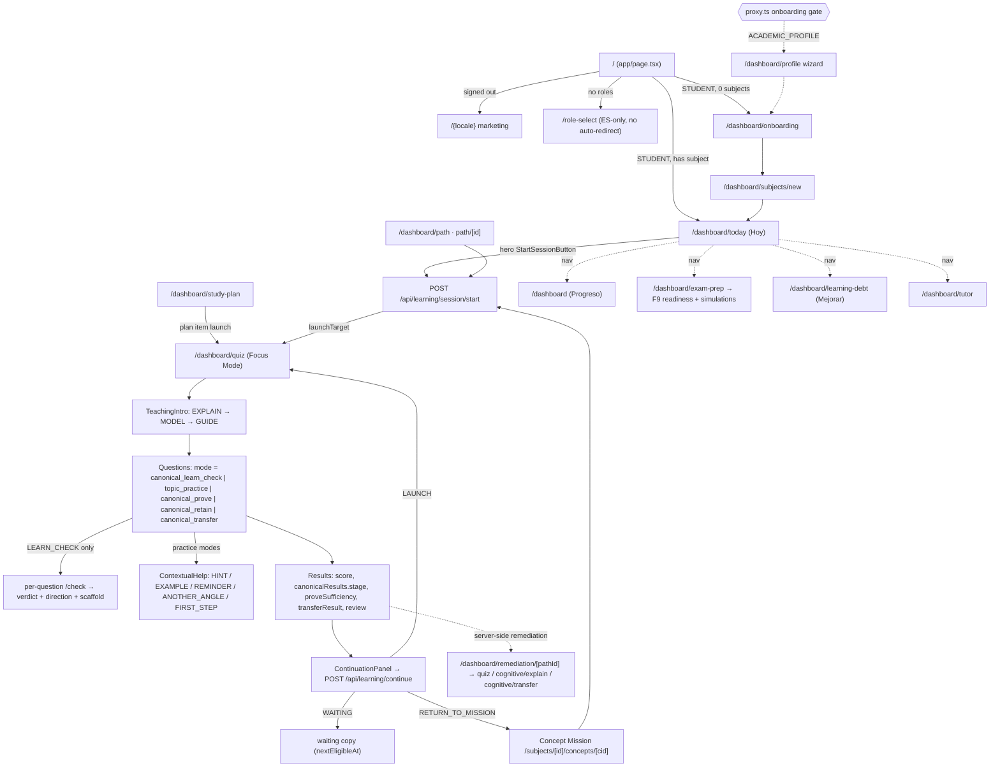

# UX-1 — Audit, Compatibility & Experience Blueprint (Student)

`UX1_BASELINE_SHA=b322e16c42f002982012074365d1bc4b219ae19c`

Status: **read-only discovery**. No application code, schema, data, env, flags, Clerk, AI config, Stage or Production were touched.
Scope: the authenticated **Student** experience only (admin / teacher / parent / institution excluded except for shared primitives).

---

## A. Executive verdict

**Most of the transformation can be delivered with frontend work alone.** Every student page is an async Server Component that already holds the authoritative data it needs. The data comes from `getLearningOSSnapshot`, `getConceptMissionView`, `buildMyPathOverview`, `getStudentProgressOverview`, the per-concept canonical decisions, and `canonicalResults` in quiz results. The current UX problems are mostly about presentation:

- **Hierarchy:** 13 nav items, 5 surfaces repeating the same "next action", and a Progress page that shows every concept × 5 KPIs.
- **Vocabulary:** two stage vocabularies, jargon ("calibración", "deuda de aprendizaje", "evidencia verificada"), raw enums in exam-prep, and "Revisar examen" shown after practice.
- **State handling:** no `loading.tsx` / `error.tsx`, and a silent submit failure.
- **Mobile:** only the shell is responsive; the pages are not.

**Some lightweight backend support would help.** It exposes truths that already exist; none of it adds decision logic. There are 9 B gaps (§F). The most material are:

- canonical `reasonCodes` / `rollback` / `intervention` / `practiceProgress`, which are computed but dropped;
- the per-question `misconception`, which is computed but not sent;
- remediation step links that are missing `subjectId`;
- the Progress overview mixing legacy and canonical journey authorities;
- a timezone-correct streak built from existing history.

**Conflicts with the cognitive model:** none of the proposed experience concepts require new cognitive logic, provided the rules in §I hold. Five candidate ideas are **C** and stay out of scope:

- a hard prerequisite unlock between concepts;
- topic/category-level readiness;
- an XP/level economy;
- persisted canonical stage-transition events;
- re-mapping the remediation `SOLO_VERIFY` mode.

The audit also found **4 places where current UI already contradicts the engine**. Fixing them is **A**:

1. The Today hero label, CTA and narrative come from the legacy `decision.activityType`, while the launch is canonical.
2. `quick_check` / `retention_check` show a "PROVED" / "RETAINED" milestone at a score of ≥ 50%. The canonical bar is 80%.
3. The legacy `masteryFillClass` 75/50 colour thresholds are duplicated in 5 files.
4. `path/[subjectId]` and the subject detail page show a Start CTA without the WAITING / zero-gap gates that Today and My Path apply.

**Mobile is feasible without touching the cognitive model.** The shell already has a drawer below 1024 px, 44 px targets and a focus trap, and a Focus Mode for learning routes. The core journey (Home → session → feedback → PROVE → result → next) needs layout and touch work only. The Tutor page is the one hard break at 390 px.

---

## B. Verified baseline

| Item | Value | How verified |
|---|---|---|
| DEV codebase | worktree `/Users/jalbornoz/PROYECTOS/studyos-dev` | `git worktree list` |
| Branch | `develop` (== `origin/develop` after fetch) | `git rev-parse` |
| HEAD | `b322e16c42f002982012074365d1bc4b219ae19c` — "docs: RETAIN -> TRANSFER integration and TRANSFER delivery certification (DEV)" | |
| Hosted DEV | `https://study-os-env-dev-study-so.vercel.app`, Vercel custom env `dev`, `dpl_DJxe8Kvn4VN1SK1gHzYJUj5V4RtF` | `GET /api/version` → `commitSha=b322e16…`, `commitRef=develop`, `deploymentTarget=dev` |
| Hosted DEV ≡ HEAD | **Yes** | same SHA |
| DB (descriptive) | Official DEV DB = a dedicated Neon branch (synthetic seed, no real data), separate from Preview and Prod; Clerk DEV instance | environment registry; no DB connection was opened in UX-1 |
| Canonical engine | `CANONICAL_ENGINE_V1_ENABLED` is present in Vercel env `dev` (value encrypted, not read). Local `.env.local` sets it. | `vercel env ls` (names only) |
| Framework | Next 16.3.5, React 19.2.8, Clerk 7, lucide-react, KaTeX, MathLive. Tailwind 4 is installed but **not imported**. | `package.json`, `globals.css` |
| Pre-existing dirty tree | `M src/components/ChatMessage.tsx`, `M tests/unit/lx9r2-tutor-math-rendering.test.ts` (**not from UX-1**, left untouched) | `git status` |

Notes on the baseline:

- The main checkout (`/Users/jalbornoz/PROYECTOS/studyos`, `main` @ `fb27dc4`) is **not** DEV. `fb27dc4` is already an ancestor of `develop`.
- Documentation-era "certified" SHAs (`9597ac8`, `e89179d`) are not the DEV baseline.

**Inspection method:** static code audit of routes, components and services, plus a live SHA probe of hosted DEV.

**Authenticated live browsing was deliberately not performed.** Merely rendering student pages mutates the DB (§F, GAP-11): it runs `getOrCreateStudentId` upserts, `checkAndResolveDebt` updates, recurring assessment-occurrence inserts, AI concept localization, and delivery-replenishment jobs scheduled via `after()` on Today and Concept. That conflicts with the UX-1 "no DB mutation" freeze. Hosted DEV is also behind Vercel Authentication plus a Clerk sign-in, which this session cannot complete.

**Responsive assessment method:** reading layout code, CSS media queries, and inline widths.

---

## C. Actual Student journey (as implemented)

**Canonical per-concept progression:** `LEARN → PRACTICE → PROVE → RETAIN (WAITING ≥ minimumWaitDays after PROVE) → TRANSFER → CONSOLIDATED`. The canonical engine decides **what** to do for a concept (`evaluateCanonicalLearningState`, `src/lib/pedagogical-engine/engine.ts`). The legacy Phase 3C ranker (`getLearningDecisions` → `buildDailyLearningPlan` → `selectExecutableNextAction`) still decides **which** concept.

**Real behaviours a redesign must respect or fix:**

- **Resume:** the server can return the same open session (`delivery.source='RESUMED'`), but the client resets to Q1 with empty answers (`quiz/page.tsx:641-642`). Answers are only persisted at submit (`recordQuizResponses`).
- **Submit failure is silent:** `setError` is called, but the error only renders in `phase==='error'` (`quiz/page.tsx:1127`).
- **Guided step can be skipped:** "Ir directo a practicar" during EXPLAIN/MODEL skips the GUIDE stage (`TeachingIntro.tsx:372-376`).
- **Broken remediation links:** EXPLAIN/TRANSFER steps link without `subjectId`/`conceptLabel` (`remediation.service.ts:492-495`), leaving an empty breadcrumb and a `/dashboard/subjects/` fallback. The `SOLO_VERIFY` step lands on the manual quiz setup form (`mode=cumulative_assessment`).
- **No error boundaries:** there are no `loading.tsx` / `error.tsx`. The Concept page throws `CANONICAL_DECISION_UNAVAILABLE` to Next's default error page.

---

## D. Screen / surface inventory (material surfaces only)

| Route | Purpose | Main components | Source of truth | Primary CTA | Mobile today | Key issue / opportunity |
|---|---|---|---|---|---|---|
| `/dashboard/today` ("Hoy") | De facto home | `today/page.tsx`, `StartSessionButton`, `WhyThisV3`, ItemRow | `getLearningOSSnapshot` (+ `canonicalOverride`), `getLearningPlanHorizon` | Hero start → `/api/learning/session/start` | Stacks, but ItemRow is a non-wrapping flex with a side button | Hero shows the legacy activity; `LEARN_CHECK` narrative is missing; two plans (`dailyPlan` vs 14-day `learning_plan`); N equal-weight Start buttons |
| `/dashboard` ("Progreso") | Achievements and progress | `dashboard/page.tsx` | `getStudentProgressOverview` | "+ Crear materia" | Header doesn't wrap (`view-head` has no CSS) | Every concept × 5 KPIs; subject % comes from legacy journey stages while concept rows are canonical; "validados" vs "dominados" |
| `/dashboard/path` ("Mi ruta") | Where am I | `path/page.tsx`, `JourneyStrip`, `journeyReason` | `buildMyPathOverview` (canonical per concept) | Same hero as Today | OK (auto-fill grids) | Duplicates the Today hero |
| `/dashboard/path/[subjectId]` | Subject route | topic `
`, `JourneyStrip` | `buildSubjectPathView` | Start on the current concept | OK | CTA ignores the WAITING / zero-gap gates; subtopic level flattened |
| `/dashboard/subjects/[id]` | Subject management + progress | `HierarchicalConceptList`, `ConceptList`, `AssessmentPanel`, `UploadPanel` | Services + `/api/exam-readiness/score` | `StartSessionButton` | **Breaks**: `ConceptList` fixed 190 px label + 4 buttons | 5 actions per row; jargon line; legacy readiness %; raw `mastery_score` |
| `/dashboard/subjects/[id]/concepts/[cid]` | Concept Mission | `ConceptMission`, JourneyRail, NowCard | `getConceptMissionView` + canonical decision | NowCard start | OK (`maxWidth 640`, rail stacks under 480 px) | Best existing "why" surface; the "Más sobre mi progreso" section is dense |
| `/dashboard/quiz` | Learning session (all modes) | `page.tsx` (2770 lines, 48 `useState`), `TeachingIntro`, `ContextualHelp`, `ContinuationPanel`, `UnifiedResponseComposer`, `MathExpressionEditor`, `ProveFocusLoading` | `/api/quizzes/generate-and-take`, `/check`, `/api/learning/teaching-intent`, `/continue` | Comprobar / Siguiente / Ver resultados / Continuar | Focus Mode; the card has 32 px padding (~292 px content); no sticky action; MathLive keyboard can cover the CTA | Silent submit error; refresh restarts; "Revisar examen" after practice; single-choice options have no `role=radio` |
| `/dashboard/remediation/[pathId]` | Remediation plan | RSC shell | `remediation-session-view` | Step link | OK | Broken EXPLAIN/TRANSFER links; hard-coded `#fff` |
| `/dashboard/cognitive/{explain,transfer}` | Explain & Defend; legacy transfer | client pages | `/api/cognitive/*` | Enviar | OK | No try/catch; plain-text math; a second TRANSFER implementation |
| `/dashboard/exam-prep` (+ `[id]`, `attempt/[id]`) | F9 readiness + simulations | `StartSimulationPanel`, `ItemRunner` | `readiness_snapshots`, `/api/simulation/*` | Start simulation | Mostly OK | Raw enums (`MINI_MOCK`, `TRAINING_TIMED`…); raw ID inputs; `language:'en'` hard-coded; LaTeX shown raw |
| `/dashboard/study-plan` | 14-day plan | client page | `/api/learning/plan*` | Empezar (a separate launch path) | OK-ish (`minWidth 220` select) | Minutes input starts at 90 and is not loaded from the server |
| `/dashboard/learning-debt` ("Mejorar") | Debt list | page | `learning_debt` | Start remediation | OK | Shows "Dominio actual X%", which the quiz page deliberately removed |
| `/dashboard/tutor` | AI tutor | `TutorChat` | `/api/tutor/*` | Send | **Broken**: `240px 1fr` grid | No error handling; 14 px input (iOS zoom) |
| Shell | Nav + Focus Mode | `LearnerShell`, `learner-navigation.ts` | layout reads | — | **Good**: drawer below 1024 px, 44 px targets, focus trap | 12–13 nav items; "Materias" not in the nav; no bottom nav |

---

## E. Current → Proposed UX matrix

**Classes:** A = UX only · B = expose existing truth · C = model change (out of scope).

| # | Moment | Internal state / source | Current UX | Proposed UX | Data sufficient? | Gap | Class | Impact |
|---|---|---|---|---|---|---|---|---|
| 1 | Entry | `resolveFirstDestination`, proxy gate | Onboarding copy says the profile is optional, but the gate forces it; role-select is ES-only with no redirect | Consistent onboarding copy; auto-continue after role; localized | Yes | — | A | M |
| 2 | Shell / nav | `buildLearnerNav` | 13 items in 3 groups | 4 primary items (Hoy · Mi ruta · Progreso · Examen) + "Más"; mobile bottom nav; Materias reachable | Yes | — | A | H |
| 3 | Home hero "Tu siguiente reto" | `snapshot.canonicalOverride.{activityType,stage,launchStatus,nextEligibleAt}` | Label from legacy `decision.activityType` | One hero driven by the canonical override (label, CTA, narrative); the legacy value only as fallback when the gate is off | **Yes (already on the page)** | — | A | **H (correctness)** |
| 4 | Why this now | `decision.facts` → `WhyThisV3` | 1 fact, fixed text | "Por qué ahora" chip + sheet with all facts | Yes | Canonical `reasonCodes` dropped | A (+B GAP-01) | M |
| 5 | Today's plan | `dailyPlan` vs `learning_plan` horizon | Two lists that may disagree | Show one "Hoy" list (`dailyPlan`); link the horizon as "Próximos días" | Yes | — | A | M |
| 6 | Recent advancement | none | — | "Lo que ya demostraste" strip | Partial (`lastQualifyingProveAt`, `last_validated_at`) | GAP-05 | B | M |
| 7 | Habit / streak | `mastery_events`, `learning_evidence` timestamps; `getStudentStreak` unused; tz not persisted | "N días esta semana" | Weekly consistency ring (existing value) now; streak later | Weekly: yes. Streak: tz-correct not available | GAP-06 | A / B | L–M |
| 8 | Understand (Descubre / Entiéndelo / Míralo) | `teachingExperience.stages` EXPLAIN / MODEL / GUIDE | Card, "Continuar"; skip bypasses GUIDE | Stepper "Entiéndelo → Míralo → Inténtalo"; skip only jumps to the next *required* stage | Yes | — | A | H |
| 9 | LEARN_CHECK (Compruébalo) | `/check` → `correct, partial, direction, scaffold` | Verdict + hint reveal | "Todavía no" / "Casi" / "Lo tienes" + progressive "Piensa en esto" | Yes | Misconception not sent | A (+B GAP-03) | H |
| 10 | PRACTICE (Entrénalo) | `topic_practice`, `LearningSupportStatus` | Question card, help toggle | Touch-first card, sticky action, help as a bottom sheet | Yes | — | A | H |
| 11 | Help / "Probemos de otra manera" | ContextualHelp ANOTHER_ANGLE; canonical `intervention:'REINFORCE'`, `rollback` | Help menu only | Use "Probemos de otra manera" **only** when (a) the student asks for ANOTHER_ANGLE or (b) the launched activity is REINFORCE / rollback | (a) yes; (b) activityType REINFORCE yes, rollback reason no | GAP-02 | A / B | M |
| 12 | Answer feedback (practice / prove) | review `finalJudgment`, `feedbackParts`, `errorType` | End-of-session list titled "Revisar examen" | "Tu repaso": per-item didWell / toFix, error as evidence | Yes | — | A | M |
| 13 | PROVE entry (Demuéstralo) | `canonical_prove`, `ProveFocusLoading` | Good loader, hard-coded "10 / diff 3-4" | Keep; bind chips to `countAuthority` / contract; add cancel / back | Mostly | — | A | M |
| 14 | PROVE result (Lo tienes / Todavía no) | `canonicalResults.{stage,requirements,nextCanonicalAction}`, `proveSufficiency` | Score + generic next card; legacy 50% "PROVED" milestone | Celebrate **only** when `requirements.PROVE.status==='SATISFIED'`; otherwise "Todavía no — te faltan n" | Yes | — | A | **H (correctness)** |
| 15 | Unlock / Desbloqueado | `requirements.*.status` LOCKED → UNSATISFIED/WAITING | Not shown | "Desbloqueado: Retención (disponible el X)" derived only from the canonical requirement status in results | Yes | — | A | M |
| 16 | Retention wait | `launchStatus='WAITING'`, `nextEligibleAt` | WAITING card | "Vuelve el {fecha} para comprobar que lo recuerdas" + countdown | Yes | — | A | M |
| 17 | Transfer | `canonical_transfer`, `transferDepth`, `transferResult` | 3-challenge intro | Challenge ladder visual | Yes | — | A | M |
| 18 | Resume after refresh | `resumed:true`; answers persisted only at submit | Restarts at Q1 | Client draft (sessionStorage keyed by `quizId`) + "Retomamos donde lo dejaste" | Yes (client-only state) | Server-side draft would be GAP-04 | A (B optional) | H (mobile) |
| 19 | Errors / loading | none | Silent submit error; default Next error page | `loading.tsx` / `error.tsx`, inline retry, keep answers | Yes | — | A | H |
| 20 | Progress | `getStudentProgressOverview` | Dense; mixed authorities | Summary first: demonstrated / in progress / needs attention; details on drill-down | Mostly | GAP-07 authority mix | A + B | H |
| 21 | Knowledge map | `getSubjectHierarchy` + per-concept canonical stage | Accordions / `
` | Subject → Topic → Concept "map" (tiles coloured by canonical stage); list on mobile | Yes | Prereq edges GAP-08 | A (+B) | M–H |
| 22 | Readiness | F9 `readiness_snapshots` (per exam profile); legacy `exam-readiness` formula | Exam-prep pages; legacy % on subject page | Status-first readiness card (F9 `overallStatus` + 7 dimensions); retire the legacy % from student view | F9: yes | Home summary GAP-09; topic-level readiness = C | A / B / C | M |
| 23 | Remediation | `remediationStepHref` | Broken links; setup form | Correct links; clear "plan de refuerzo" | Links: no | GAP-10 | B | H |
| 24 | Exam-prep copy | enums | Raw enums, IDs | Localized labels, pickers | Yes | — | A | M |
| 25 | Tutor | TutorChat | Broken at 390 px | Conversation list in a drawer | Yes | — | A | M |
| 26 | Gamification economy (XP / levels / badges) | none | — | Not proposed | — | — | **C** | — |
| 27 | Prerequisite unlock between concepts | only `PREREQUISITE_GAP` signal | — | Not proposed (visualize edges only) | — | — | **C** | — |
| 28 | Topic / category readiness | none | — | Not proposed; use F9 dimensions | — | — | **C** | — |

**Counts:** 28 moments.

- **A-led: 21** (1–5, 8–10, 12–19, 21, 24, 25). Three of them, 4, 9 and 21, are also improved by an optional B.
- **B-led: 4** (6, 11 partial, 20 partial, 23). Readiness (22) is mixed A/B/C.
- **C: 3** (26–28), plus the two C items in §F: GAP-12 and the `SOLO_VERIFY` mode.

---

## F. Backend Gap Map

The key distinction: **exists but not exposed** vs **does not exist**.

| GAP | Experience need | Truth exists? / where | FE receives today? | Smallest change | Migration | Persistence | API contract | Changes cognition | Class | Recommendation |
|---|---|---|---|---|---|---|---|---|---|---|
| GAP-01 | Human "why" for the next step and for results | **Yes**: `CanonicalPedagogicalDecision.reasonCodes`, `requirements[].reasonCodes`, `practiceProgress` (engine) | No. Dropped in `CanonicalLearningSession` (`canonical-session-launch.ts:43-57`); `canonicalResults` omits `practiceProgress` / `rollback` / `intervention` | Add those fields (read-only passthrough) to the snapshot override and to `canonicalResults` | No | No | Additive fields | No | B | Do in UX-3 if the UX-2 "why" copy proves insufficient |
| GAP-02 | Truthful "Probemos de otra manera" after a rollback | **Yes**: `rollback`, `intervention` (engine) | No | Same passthrough as GAP-01 | No | No | Additive | No | B | Bundle with GAP-01 |
| GAP-03 | Misconception-aware feedback | **Yes**: `pedagogical.misconception` in `generate-and-take/route.ts:~1694`; `computeTeachingIntent.misconceptionCodes` | No (stored in evidence metadata only) | Add a learner-safe `misconceptionLabel` to review items / `check` | No | No | Additive | No | B | Medium value; verify copy safety first |
| GAP-04 | Server-side resume of in-progress answers | **No**: answers persisted only at submit (`recordQuizResponses`) | — | Draft-answer persistence | Likely | **Yes** | Yes | No (if drafts are never evidence) | B (heavy) | **Don't.** Use a client-side draft (A) |
| GAP-05 | "Lo que ya demostraste" / recent advancement | **Partial**: `lastQualifyingProveAt` (canonical), `concept_knowledge_state.last_validated_at`, `concept_memory_state.last_successful_retention_at`, `concept_transfer_state.last_successful_transfer_at`, `decision_events KNOWLEDGE_STATE_PROJECTED` | No | Read-only query returning the latest N timestamps per concept (no new events) | No | No | New read endpoint or RSC service | No | B | UX-3 |
| GAP-06 | Streak | **Data yes** (`learning_evidence.timestamp`, `mastery_events`); `getStudentStreak` exists (no callers); **tz not persisted** (`students.timezone` never written; `student_availability.timezone` only via study-plan) | Weekly count only | Resolve tz via the existing `availability → students → UTC` chain and call the existing function | No | Maybe (write tz on first visit) | No | No | B | UX-3; ship a weekly ring first (A) |
| GAP-07 | Consistent progress numbers | **Yes** (canonical per concept) | Mixed: `progress-overview.service.ts` subject / overall % use legacy `resolveConceptJourneyStage` (:203-205, :279, :293) | Use the canonical-aware resolver already used per concept / on the subject page | No | No | No | No (display authority only) | B | **UX-2 dependency** for Progress; small |
| GAP-08 | Prerequisite edges on the knowledge map | **Yes**: `concept_relationships` (`PREREQUISITE_OF`…), `concept-graph.service.ts` | No (only a count in the `prerequisiteGap` fact) | Include edges in the subject path view model | No | No | Additive (RSC) | No | B | UX-3; visual only, never gating |
| GAP-09 | Readiness summary on Home | **Yes**: latest `readiness_snapshots` per exam profile | Only on exam-prep pages | RSC read of the latest snapshot per active exam profile | No | No | No | No | B | UX-2 optional |
| GAP-10 | Working remediation steps | **Yes**: the path has `subjectId`; the concept label is known | Links lack `subjectId` / `conceptLabel` (`remediation.service.ts:478-496`) | Add params to `remediationStepHref` | No | No | URL only | No | B | **Fix before / with UX-2** (it's a bug) |
| GAP-11 | Side-effect-free page views | **No**: GET renders write (upserts, `checkAndResolveDebt`, assessment occurrences, AI localization, `after()` replenishment) | — | Not a UX change | — | — | — | — | Note | Document only. It limits safe live UX testing; use the seeded DEV test student |
| GAP-12 | "Unlocked concept" between concepts | **No** (prereqs only as signal) | — | New gating | — | — | — | **Yes** | **C** | Out of scope |
| GAP-13 | Topic / category readiness | **No** | — | New semantics | — | — | — | **Yes** | **C** | Out of scope; use F9 dimensions |
| GAP-14 | Remediation `SOLO_VERIFY` lands on the setup form | Mode mapping is `cumulative_assessment` | — | Changing the mode changes which activity runs | — | — | — | **Yes (activity)** | **C** (product decision) | Escalate; UX may at most hide the setup form fields and auto-start with the server defaults, *if* product confirms |

**Out-of-scope security note (found in passing):** `GET /api/readiness` and `POST /api/readiness/compute` authorize `studentId`, but read or compute by `examProfileId` without checking that the profile belongs to that student (`src/app/api/readiness/route.ts:32`, `readiness.service.ts:197-205`). This is a possible cross-learner read by profile UUID. It is recorded here for separate handling and was **not** fixed in UX-1.

---

## G. Mobile viability map

The target journey is LOGIN → HOME → NEXT → LEARN → PRACTICE → FEEDBACK/HELP → PROVE → RESULT → NEXT.

| Tier | Surface | Needed changes (all A) |
|---|---|---|
| **MUST** | Sign-in (Clerk) | Already OK |
| MUST | Home / Today | Single hero; sticky primary CTA; ItemRow wraps; "why" as a bottom sheet |
| MUST | Quiz: teaching stages | Card padding 32 → 16 px under 600 px; stepper; full-width CTAs; no `nowrap` overflow on long ES labels |
| MUST | Quiz: question + answer | Sticky bottom action bar (respect MathLive keyboard / `visualViewport`); `role=radiogroup` options ≥ 48 px; inputs ≥ 16 px (iOS zoom); `overflow-x:auto` on display math; matching / classification stacked vertically; reorder via ≥ 44 px controls |
| MUST | Help | Bottom sheet instead of an inline menu; 44 px actions |
| MUST | LEARN_CHECK feedback / results / continuation | Stacked result; one primary "Continuar"; review collapsible |
| MUST | PROVE loader + result | Already fine (loader); result celebration fits one screen |
| MUST | Error / resume | Inline error; client draft restore |
| **SHOULD** | My Path / subject path | Vertical list of topics → concepts with a compact JourneyStrip (already wraps) |
| SHOULD | Concept Mission | Already `maxWidth 640`; collapse "Más sobre mi progreso" |
| SHOULD | Progress | Summary cards only; per-concept detail behind drill-down |
| SHOULD | Retention wait / transfer intro | Already simple |
| SHOULD | Tutor | Conversation list → drawer; fixed-height grid → `100dvh` flex |
| SHOULD | Exam-prep readiness (read) | Status card + dimension list |
| **DESKTOP FIRST** | Subject management (upload, extraction, concept delete, settings) | Reduced mobile: read-only list + "Abre en ordenador para gestionar" |
| DESKTOP FIRST | Knowledge map (graph view) | Mobile gets the hierarchical list |
| DESKTOP FIRST | Full exam simulations (timed, long) | Usable but not optimized |
| DESKTOP FIRST | Study-plan editing (reschedule / skip / capacity) | Mobile: view + start only |
| DESKTOP FIRST | Dense analytics ("todos los detalles") | Collapsed |

**Mobile verdict:** viable with frontend work alone. The blockers are layout-level: card padding, the sticky action, keyboard overlap, touch targets, 16 px inputs, math overflow, and Tutor. None needs backend work.

---

## H. Proposed UX Blueprint (same engine)

**Narrative mapping.** This is labels only; internal enums are untouched. The mapping is driven by the canonical stage / activity, never computed.

| Narrative | Internal source (authoritative) | Rule |
|---|---|---|
| **Descubre** | Onboarding / cold state (`deriveTodayState` COLD, `MyPathState` COLD) | — |
| **Enfócate** | Home hero = `nextExecutableItem` + `canonicalOverride` | Shows exactly one action |
| **Aprende** (Entiéndelo · Míralo · Inténtalo) | `teachingExperience.stages` EXPLAIN · MODEL · GUIDE; stage `LEARN`, activity `LEARN_CHECK` = "Compruébalo" | Stages come from the server |
| **Practica** ("Entrénalo") | activity `PRACTICE` / mode `topic_practice`; `REINFORCE` = "Refuerza" | — |
| **Demuestra** ("Demuéstralo") | activity `PROVE` / `canonical_prove`; `RETENTION_CHECK` = "¿Lo recuerdas?"; `TRANSFER` = "Aplícalo" | Never shown unless the engine launches it |
| **Avanza** ("Lo tienes / Dominado / Desbloqueado") | `requirements[stage].status === 'SATISFIED'` in `canonicalResults`; `CONSOLIDATED` = "Dominado" | Celebration only on SATISFIED |
| **Todavía no** | Requirement still `UNSATISFIED`; LEARN_CHECK `correct=false` | Neutral, evidence-framed |
| **Probemos de otra manera** | Student-chosen ANOTHER_ANGLE, or launched activity `REINFORCE` | Not shown otherwise |

**Unify vocabulary.** Replace the two stage dictionaries (`conceptMission.stage.*` vs `myPathStage.*`) with one. Remove "quiz", "examen", "evidencia", "calibración" and "deuda" from student copy. Use tú consistently (voseo currently leaks into `progress.subtitle`).

**Surfaces:**

- **Student Home ("Hoy").**
  - Greeting and goal line (active subject / exam profile).
  - **Tu siguiente reto** hero. It shows the canonical activity label, concept, minutes and one "por qué", and has a sticky CTA.
  - "Hoy también" (rest of `dailyPlan`, secondary CTAs muted).
  - "Tu semana" (learning days this week, existing).
  - A readiness chip if an exam profile exists (GAP-09, optional).
  - WAITING and CONSOLIDATED states become celebratory / calm cards.
- **Learning session.**
  - Focus Mode is kept.
  - Top: a stage stepper (Entiéndelo · Míralo · Inténtalo · Compruébalo | Entrénalo | Demuéstralo) plus question progress `n/N` from `countAuthority`.
  - Content card, then a sticky action bar.
  - Help opens a bottom sheet. Support status is shown as "Con ayuda" / "Por tu cuenta" (existing `LearningSupportStatus`).
- **Feedback.**
  - LEARN_CHECK: inline verdict (Lo tienes / Casi / Todavía no), "Piensa en esto" (`direction`), progressive `scaffold`.
  - Other modes: end-of-activity "Tu repaso" built from `feedbackParts`. Errors are framed as "lo que te enseña este error" (`errorType`).
- **Remediation.** "Plan de refuerzo": steps as a checklist with the existing step types in learner language. Depends on the GAP-10 link fix.
- **PROVE.**
  - A distinct "challenge" treatment (darker surface, no help, clear rules).
  - The result shows SATISFIED → "Lo tienes — demostrado", and the next unlocked stage from `requirements`.
  - UNSATISFIED → "Todavía no — {n} demostraciones más" (`proveSufficiency`).
  - **Remove the legacy 50% milestone.**
- **Mastery / progress.**
  - Three buckets: *Demostrado* (PROVE satisfied or later), *En camino*, *Necesita atención* (debt).
  - The per-concept JourneyStrip is the single progress visual.
  - Percentages come only from `journeyProgressPercent` (server). No client thresholds: replace the 75/50 `masteryFillClass` with stage colours.
- **Readiness.** F9 `overallStatus` as the headline (a status ladder, not a %), plus 7 dimensions with `whatWouldImproveConfidence`. The legacy formula % is not shown to students.
- **Knowledge.** The subject map is Topic → Concept tiles coloured by canonical stage, with the current concept highlighted. The mobile version is a list. Edges are added later (GAP-08).
- **Next action.** One component, `<NextChallenge>`, is used by Today, My Path, Subject and Concept. It consumes one server-built view model, so the gates are identical everywhere.
- **Mobile.** Bottom nav (Hoy · Ruta · Progreso · Más), drawer kept for "Más", Focus Mode for sessions, sticky CTAs, bottom sheets for help and "why".

**Visual territory (Learning × Training × Performance).**

- Keep the existing CSS-variable tokens (`--brand #2F6B5E`, status colours, radius and spacing scale). Add type-scale tokens, an `info` role, and elevation levels.
- Performance-style data typography: `tabular` numerals, rings and bars for stage progress.
- Restrained motion: stage-advance transitions and a single celebration moment on SATISFIED, respecting `prefers-reduced-motion`.
- Replace emoji and Unicode glyph icons with lucide.
- No mascots, no neon, no brain or robot imagery.

---

## I. UX Technical Boundary

| Frontend **may decide** | Frontend **may only display** | Remains **authoritative backend / cognitive** |
|---|---|---|
| Layout, hierarchy, navigation, responsive patterns | `canonicalOverride.{activityType,stage,launchStatus,nextEligibleAt}` | Which concept (`getLearningDecisions` ranking) |
| Copy and labels for existing enums (1:1 lookup tables) | `requirements[*].status`, `journeyProgressPercent`, `proveSufficiency` | Which activity / stage (`evaluateCanonicalLearningState`) |
| Ordering and collapsing of existing facts | `decision.facts`, `planItemWhyKey`, `teachingExperience.*` | Mastery, readiness, retention timing, transfer, remediation |
| Animation and celebration **triggered by** a server status change | F9 readiness `overallStatus` / dimensions | Scoring, `finalJudgment`, evidence qualification |
| Client-only draft of unsubmitted answers (never sent as evidence) | Review `finalJudgment` / `feedbackParts` / `errorType` | Help availability (`canUseAI`, server-enforced) |
| Which stage copy / visual to show for a server-given state | Learning days / streak values (server-computed) | Unlock / gating, difficulty, item count |

**Forbidden in UI:**

- Thresholds on scores (e.g. `messageKey !== 'keep_going'` → PROVED, the 75/50 fill classes, the hard-coded "> 85%").
- Averaging concept values into a new subject metric in client components (`HierarchicalConceptList.tsx:26-45`).
- Duplicated mode taxonomies (`PRACTICE_EVIDENCE_MODES`, `QUIZ_MODE_BY_STEP_TYPE`).
- Choosing a CTA from a legacy field when a canonical field is present.

**Low-coupling architecture (rework prevention).**

- **Do not create a new HTTP "Experience API."** Student pages are RSCs calling services directly.
- Instead add a server-only **experience presenter layer**, `src/lib/experience/*`. It holds pure functions (`toNextChallengeView(snapshot)`, `toStageLabel(stage)`, `toResultView(canonicalResults)`) that map existing authoritative objects to view models.
  - It is one place where the canonical-over-legacy precedence and the WAITING / zero-gap gates live, replacing the 5 divergent copies.
  - It is unit-testable and needs no new persistence.
- Client components receive props only. The few client islands (quiz) consume the same presenters through the existing responses.
- **Debt to avoid:** new local enum maps in pages; new percentages; a second design system; enabling Tailwind preflight wholesale (it would reset the existing hand-built CSS); a parallel quiz page. Refactor `quiz/page.tsx` by extraction instead of rewriting it.

---

## J. Recommended UX-2 scope: **Experience Foundation + Student Shell + Home**

**1. Experience Foundation (A)**

- Formalize the existing tokens: type scale, `info`, elevation, and dark-mode fixes for hard-coded `#fff` / undefined vars. Rationalize breakpoints to **≤599 / 600–1023 / ≥1024**, which are already the de facto set; drop 480 except where it is needed.
- Component primitives backed by the existing CSS classes: `Button` (44 px min; fixes `.btn-sm` / `.btn-ghost` 32 px), `Card`, `Badge` (fixes `StatusBadge` neutral/info), `ProgressBar` / `StageStrip` (`role=progressbar`), `Sheet` (bottom sheet), `Skeleton`, `InlineAlert`, `EmptyState`, `StickyActionBar`.
- Swap the icon system to lucide.
- `src/lib/experience/` presenters plus a **single learner vocabulary** dictionary layered on `messages.ts`, merging the two stage vocabularies, adding `todayNarrative.LEARN_CHECK`, and fixing tú/voseo.
- Route-level `loading.tsx` / `error.tsx` for `/dashboard/*`.

**2. Student Shell (A)**

- Nav reduced to 4 primary items plus "Más"; mobile bottom nav under 600 px; drawer kept.
- Materias reachable; localized unauthenticated fallback; role-select localized with auto-continue.

**3. Home / Today (A)**

- A `<NextChallenge>` hero built from `canonicalOverride` (fixes the legacy-label mismatch) and reused on My Path, Subject and Concept so the gates are identical.
- One "Hoy" list; the horizon as a link; "Tu semana" from existing learning days.
- Calm WAITING and CONSOLIDATED states; fix the cold-state CTA target.

**Dependencies and preconditions:**

- **GAP-07** (Progress overview authority) only if UX-2 touches Progress. Otherwise defer to UX-3.
- **GAP-10** (remediation links) is a bug. Fix it in a separate small backend PR before or in parallel with UX-2.
- A seeded DEV test student for visual verification, because page renders mutate the DB (GAP-11). Use DEV only, never Stage or Prod.
- Tests: presenter unit tests must assert that the canonical field takes precedence and that no thresholds exist.

**Explicitly not in UX-2 (UX-3+):**

- The quiz page restructure (sticky action, bottom-sheet help, resume draft, silent-error fix, removing the 50% milestone). The silent-error fix and milestone removal are recommended as the first UX-3 items, or as hotfixes.
- Progress / knowledge map redesign; readiness card; GAP-01/02/03/05/06/08/09.
- All C items.
